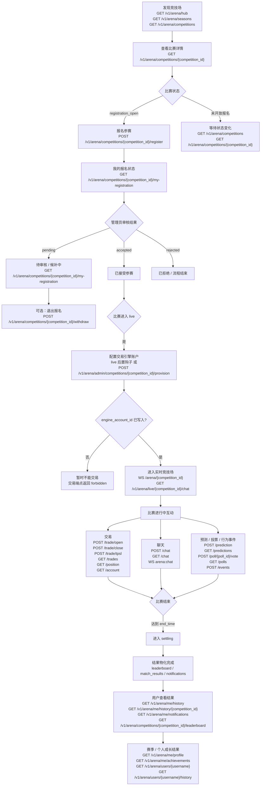

# 交易竞技场模块 API 接口文档

本文档定义了交易竞技场（Trading Arena）模块的 REST API 端点、请求参数和响应结构。该模块是基于现有量化比赛后端构建的实时交易竞赛平台。

> **最后更新：** 2026-03-13

## 实现状态

| 章节 | 范围 | 状态 | 阶段 |
| :--- | :--- | :--- | :--- |
| 1. 通用约定 | 竞技场特定约定 | **已完成** | 第二阶段 |
| 2. 公开端点 | 健康检查、段位、赛季、比赛列表/详情 | **已完成** | 第二阶段 |
| 3. 管理端点 | 赛季/比赛 CRUD、复制、段位管理 | **已完成** | 第二阶段 |
| 4. 比赛状态机 | 管理员转换、自动 tick、状态审计日志 | **已完成** | 第三阶段 |
| 5. 报名（用户） | 报名、退出、查看报名、参赛者列表 | **已完成** | 第三阶段 |
| 6. 报名（管理员） | 审核、批量审核、自动接受、报名列表 | **已完成** | 第三–四阶段 |
| 7. Hub 与用户数据 | Hub 仪表盘、个人资料、报名、历史、成就、通知 | **已完成** | 第五阶段 |
| 8. 报名状态值 | 状态定义、候补排序 | **已完成** | 第三阶段 |
| 9. 排行榜与公开资料 | 比赛/赛季排行榜、公开用户资料、比赛历史 | **已完成** | 第六阶段 |
| 10. 实时竞技场（WS + REST） | WebSocket 推送 + 交易/聊天/预测/投票 REST 操作、实时排行榜 | **已完成** | 第七阶段 |
| 11. 配置 | 竞技场环境变量 | **已完成** | 第二阶段 |
| 12. RBAC 权限 | 竞技场 RBAC 权限 | **已完成** | 第三阶段 |
| 13. API Key 认证 | API Key CRUD、双路径认证、按比赛的 API 访问控制 | **已完成** | 第七C阶段 |
| 14. 后续端点 | 统计、资料编辑 | 未开始 | 第八阶段 |

---

## 1. 通用约定

*   **基础 URL：** `/v1/arena`
*   **内容类型：** `application/json`
*   **身份验证：** 平台支持两种认证方式：
    *   **Cognito JWT（Web UI）：** `Authorization: Bearer <cognito_id_token>` — 用于 Web 前端。
    *   **API Key（编程接口）：** `X-API-Key: <live_api_key>` — 用于机器人/脚本访问。API Key 有作用域限制（见 §12）。
    *   如果同时提供两种凭证，请求将被拒绝并返回 `400`。
    *   公开端点（赛季列表、比赛列表/详情、健康检查）允许 Web 用户无需身份验证即可访问。但当提供 API Key 时，会强制检查相应的作用域（例如，arena 数据需要 `arena:read`，行情数据需要 `market:read`）。
    *   **WebSocket** 连接仅接受 Cognito JWT — 不支持 API Key 认证。
*   **管理端点：** 所有 `/v1/arena/admin/*` 端点需要特定的 RBAC 权限（如 `season:manage`、`competition:manage`）。
*   **时间格式：** Unix 毫秒时间戳（例如：`1707667200000`）。
*   **响应包装：** 所有响应使用标准信封格式：

```json
{
  "code": 0,
  "message": "success",
  "data": { ... },
  "timestamp": 1707667200000
}
```

*   **分页：** 列表端点使用 `PaginatedData` 包装：

```json
{
  "code": 0,
  "message": "success",
  "data": {
    "list": [ ... ],
    "total": 42,
    "page": 1,
    "size": 20
  },
  "timestamp": 1707667200000
}
```

### 1.1 完整用户生命周期

下图展示了竞技场模块中的完整用户旅程，从发现比赛与报名开始，经过审核、实时参与，最终进入结算与历史查看。



生命周期说明：

| 阶段 | 主要要求 | 主要端点 |
| :--- | :--- | :--- |
| 发现阶段 | 无需认证 | `GET /v1/arena/hub`、`GET /v1/arena/seasons`、`GET /v1/arena/competitions` |
| 报名阶段 | 比赛必须处于 `registration_open`，且用户满足报名条件 | `POST /v1/arena/competitions/{competition_id}/register` |
| 审核阶段 | 管理员接受 / 拒绝 / 候补处理报名 | `POST /v1/arena/admin/registrations/{registration_id}/review`、`POST /v1/arena/admin/registrations/bulk-review`、`POST /v1/arena/admin/competitions/{competition_id}/registrations/auto-accept` |
| 配置阶段 | 比赛必须已进入 `live`；被接受的报名需要分配交易引擎账户 | live 后置钩子、`POST /v1/arena/admin/competitions/{competition_id}/provision` |
| 实时参与阶段 | 用户必须已接受且已完成 provisioning | `WS /arena/{competition_id}`、`/v1/arena/live/*` 端点 |
| 结算与结果阶段 | 比赛从 `settling` 最终进入 `completed` | 比赛排行榜、历史记录、通知、个人资料相关端点 |

### 1.2 竞技场错误码

| 错误码 | HTTP 状态码 | 含义 |
| :--- | :--- | :--- |
| 0 | 200/201 | 成功 |
| 1001 | 400 | 无效参数 |
| 1003 | 400 | 无效时间线 — 时间顺序违规（如 `end_time <= start_time`） |
| 2001 | 409 | Slug 冲突 — 赛季或比赛 slug 已存在 |
| 3001 | 401 | 未授权 — 缺少或无效的 Cognito 令牌 |
| 3002 | 403 | 禁止 — RBAC 权限不足 |
| 4001 | 404 | 资源未找到（公开端点中已归档的资源也返回 404） |
| 5001 | 409 | 已报名该比赛 |
| 5002 | 403 | 不满足参赛条件（赛季积分、段位、仅限邀请） |
| 5003 | 400 | 当前状态不允许执行该操作（如非 `registration_open`） |
| 5004 | 409 | 乐观锁冲突 — 比赛状态已被其他请求修改 |
| 5005 | 400 | 比赛已满员 — 无法接受更多参赛者 |
| 6001 | 403 | API 读取访问被拒绝 — 比赛不允许 API Key 读取访问 |
| 6002 | 403 | API 写入访问被拒绝 — 比赛不允许 API Key 写入访问 |
| 6003 | 403 | API Key 作用域不足 — 密钥缺少此端点所需的作用域 |
| 6004 | 400 | 双重凭证 — 同时提供了 Bearer 令牌和 X-API-Key |

---

## 2. 公开端点（无需身份验证）

### 2.1 健康检查

*   **端点：** `GET /v1/arena/health`
*   **响应数据（200 OK）：**
    ```json
    {
      "ok": true,
      "ts": 1707667200000
    }
    ```

### 2.2 获取段位列表

*   **端点：** `GET /v1/arena/tiers`
*   **说明：** 返回所有段位定义，按 `order` 升序排列。公开端点，无需认证。
*   **响应数据（200 OK）：**
    ```json
    [
      {
        "id": 1,
        "key": "iron",
        "label": "Iron",
        "minPoints": 0,
        "leverage": 1.0,
        "order": 1
      },
      {
        "id": 2,
        "key": "bronze",
        "label": "Bronze",
        "minPoints": 100,
        "leverage": 1.5,
        "order": 2
      }
    ]
    ```

### 2.3 获取赛季列表

返回所有未归档赛季，按开始日期降序排列。

*   **端点：** `GET /v1/arena/seasons`
*   **响应数据（200 OK）：** `Season[]`
    ```json
    [
      {
        "id": 1,
        "name": "2026年3月赛季",
        "slug": "2026-03",
        "status": "active",
        "regularMatchCount": 15,
        "grandFinalEnabled": true,
        "pointsDecayFactor": 0.8,
        "startDate": 1709251200000,
        "endDate": 1711929600000,
        "archived": false,
        "createdAt": 1709000000000,
        "updatedAt": 1709000000000
      }
    ]
    ```

    | 字段 | 类型 | 描述 |
    | :--- | :--- | :--- |
    | `id` | integer | 赛季 ID |
    | `name` | string | 显示名称 |
    | `slug` | string | URL 安全的唯一标识符 |
    | `status` | string | `"upcoming"` \| `"active"` \| `"completed"` |
    | `regularMatchCount` | integer | 赛季内常规赛数量 |
    | `grandFinalEnabled` | boolean | 是否启用总决赛 |
    | `pointsDecayFactor` | float | 积分衰减系数 |
    | `startDate` | integer | 赛季开始时间戳（Unix 毫秒） |
    | `endDate` | integer | 赛季结束时间戳（Unix 毫秒） |
    | `archived` | boolean | 公开端点中始终为 `false` |
    | `createdAt` | integer | 创建时间戳（Unix 毫秒） |
    | `updatedAt` | integer | 最后更新时间戳（Unix 毫秒） |

### 2.3 获取赛季详情

返回单个赛季及比赛统计摘要。已归档赛季返回 `404`。

*   **端点：** `GET /v1/arena/seasons/{season_id}`
*   **路径参数：**

    | 参数 | 类型 | 描述 |
    | :--- | :--- | :--- |
    | `season_id` | integer | 赛季 ID |

*   **响应数据（200 OK）：** `SeasonDetail`
    ```json
    {
      "id": 1,
      "name": "2026年3月赛季",
      "slug": "2026-03",
      "status": "active",
      "regularMatchCount": 15,
      "grandFinalEnabled": true,
      "pointsDecayFactor": 0.8,
      "startDate": 1709251200000,
      "endDate": 1711929600000,
      "archived": false,
      "createdAt": 1709000000000,
      "updatedAt": 1709000000000,
      "competitionCount": 5,
      "activeCompetitionCount": 1
    }
    ```

    在 `Season` 基础上新增的字段：

    | 字段 | 类型 | 描述 |
    | :--- | :--- | :--- |
    | `competitionCount` | integer | 赛季内的比赛总数 |
    | `activeCompetitionCount` | integer | 当前正在进行的比赛数 |

*   **错误响应：**

    | HTTP | 条件 |
    | :--- | :--- |
    | 404 | 赛季不存在或已归档 |

### 2.4 获取比赛列表

返回分页的未归档比赛列表，支持筛选。

*   **端点：** `GET /v1/arena/competitions`
*   **查询参数：**

    | 参数 | 类型 | 默认值 | 描述 |
    | :--- | :--- | :--- | :--- |
    | `seasonId` | integer | — | 按赛季 ID 筛选 |
    | `status` | string | — | 按状态筛选（如 `"live"`、`"registration_open"`） |
    | `type` | string | — | 按比赛类型筛选（`"regular"`、`"grand_final"` 等） |
    | `page` | integer | 1 | 页码（>= 1） |
    | `size` | integer | 20 | 每页数量（1–100） |

*   **响应数据（200 OK）：** `PaginatedData[CompetitionSummary]`
    ```json
    {
      "list": [
        {
          "id": 1,
          "seasonId": 1,
          "title": "第1场常规赛",
          "slug": "2026-03-r01",
          "competitionNumber": 1,
          "competitionType": "regular",
          "status": "live",
          "symbol": "BTCUSDT",
          "startTime": 1709308800000,
          "endTime": 1709316000000,
          "maxParticipants": 50,
          "registeredCount": 32,
          "prizePool": 500.0,
          "coverImageUrl": null,
          "allowApiRead": true,
          "allowApiWrite": false
        }
      ],
      "total": 5,
      "page": 1,
      "size": 20
    }
    ```

    | 字段 | 类型 | 描述 |
    | :--- | :--- | :--- |
    | `id` | integer | 比赛 ID |
    | `seasonId` | integer | 所属赛季 ID |
    | `title` | string | 显示标题 |
    | `slug` | string | URL 安全的唯一标识符 |
    | `competitionNumber` | integer | 赛季内的序号 |
    | `competitionType` | string | `"regular"` \| `"grand_final"` \| `"special"` \| `"practice"` |
    | `status` | string | 当前状态（见状态机部分） |
    | `symbol` | string | 交易对（如 `"BTCUSDT"`） |
    | `startTime` | integer | 比赛开始时间戳（Unix 毫秒） |
    | `endTime` | integer | 比赛结束时间戳（Unix 毫秒） |
    | `maxParticipants` | integer | 最大参赛人数 |
    | `registeredCount` | integer | 当前报名人数（待审核 + 已接受） |
    | `prizePool` | float | 总奖金池 |
    | `coverImageUrl` | string \| null | 封面图 URL |
    | `allowApiRead` | boolean | 是否允许 API Key 读取访问（默认：true） |
    | `allowApiWrite` | boolean | 是否允许 API Key 写入访问（默认：false） |

### 2.5 获取比赛详情

按 ID（数字）或 slug 获取完整比赛详情。已归档的比赛返回 `404`。

*   **端点：** `GET /v1/arena/competitions/{identifier}`
*   **路径参数：**

    | 参数 | 类型 | 描述 |
    | :--- | :--- | :--- |
    | `identifier` | string | 比赛 ID（数字）或 slug |

    > **说明：** 如果标识符为纯数字，系统先尝试 ID 查询，未找到则回退到 slug 查询。

*   **响应数据（200 OK）：** `CompetitionDetail`

    包含 `CompetitionSummary` 的所有字段，以及以下额外字段：

    | 字段 | 类型 | 描述 |
    | :--- | :--- | :--- |
    | `description` | string \| null | 详细描述 |
    | `registrationOpenAt` | integer \| null | 报名开始时间戳（Unix 毫秒） |
    | `registrationCloseAt` | integer \| null | 报名截止时间戳（Unix 毫秒） |
    | `minParticipants` | integer | 最低开赛人数 |
    | `startingCapital` | float | 每位参赛者的虚拟起始资金 |
    | `maxTradesPerMatch` | integer | 每位参赛者的最大交易次数 |
    | `closeOnlySeconds` | integer | 结束前仅允许平仓的秒数 |
    | `feeRate` | float | 交易手续费率 |
    | `prizeTableJson` | string \| null | JSON：排名 → 奖金百分比 |
    | `pointsTableJson` | string \| null | JSON：排名 → 获得积分 |
    | `requireMinSeasonPoints` | integer | 报名所需最低赛季积分 |
    | `requireMinTier` | string \| null | 报名所需最低段位（如 `"gold"`） |
    | `inviteOnly` | boolean | 是否仅限邀请 |
    | `allowApiRead` | boolean | 是否允许 API Key 读取访问 |
    | `allowApiWrite` | boolean | 是否允许 API Key 写入访问 |
    | `createdBy` | string \| null | 创建者的管理员 UUID |
    | `seasonName` | string \| null | 所属赛季名称 |
    | `seasonSlug` | string \| null | 所属赛季 slug |

*   **错误响应：**

    | HTTP | 条件 |
    | :--- | :--- |
    | 404 | 比赛不存在或已归档 |

---

## 3. 管理端点（需要权限）

所有管理端点位于 `/v1/arena/admin/*`，需要 RBAC 权限。

### 3.1 获取赛季列表（管理员）

与公开列表相同，但支持 `include_archived` 查询参数。

*   **端点：** `GET /v1/arena/admin/seasons`
*   **权限：** `season:manage`
*   **查询参数：**

    | 参数 | 类型 | 默认值 | 描述 |
    | :--- | :--- | :--- | :--- |
    | `include_archived` | boolean | false | 是否包含已归档赛季 |

*   **响应数据（200 OK）：** `Season[]`

### 3.2 获取赛季详情（管理员）

与公开详情相同，但始终返回赛季（包括已归档的）。

*   **端点：** `GET /v1/arena/admin/seasons/{season_id}`
*   **权限：** `season:manage`
*   **响应数据（200 OK）：** `SeasonDetail`

### 3.3 创建赛季

*   **端点：** `POST /v1/arena/admin/seasons`
*   **权限：** `season:manage`
*   **请求体：**
    ```json
    {
      "name": "2026年3月赛季",
      "slug": "2026-03",
      "status": "upcoming",
      "regular_match_count": 15,
      "grand_final_enabled": true,
      "points_decay_factor": 0.8,
      "start_date": 1709251200000,
      "end_date": 1711929600000
    }
    ```

    | 字段 | 类型 | 必填 | 描述 |
    | :--- | :--- | :--- | :--- |
    | `name` | string | 是 | 赛季名称（1–64 字符） |
    | `slug` | string | 是 | URL 安全标识符（1–32 字符，`[a-z0-9-]`） |
    | `status` | string | 否 | 初始状态（默认 `"upcoming"`） |
    | `regular_match_count` | integer | 否 | 常规赛数量（默认 15，范围 1–100） |
    | `grand_final_enabled` | boolean | 否 | 是否启用总决赛（默认 `true`） |
    | `points_decay_factor` | float | 否 | 衰减系数（默认 0.8，范围 0.0–1.0） |
    | `start_date` | integer | 是 | 赛季开始时间（Unix 毫秒） |
    | `end_date` | integer | 是 | 赛季结束时间（Unix 毫秒），必须晚于 `start_date` |

*   **响应数据（201 Created）：** `Season`
*   **错误响应：**

    | HTTP | 条件 |
    | :--- | :--- |
    | 400 | `end_date <= start_date` |
    | 409 | Slug 已存在 |

### 3.4 更新赛季

*   **端点：** `PUT /v1/arena/admin/seasons/{season_id}`
*   **权限：** `season:manage`
*   **请求体：** 与创建相同的字段，均为可选。仅更新提供的字段。更新后会验证合并状态下 `end_date > start_date`。
*   **响应数据（200 OK）：** `Season`
*   **错误响应：**

    | HTTP | 条件 |
    | :--- | :--- |
    | 400 | 合并后 `end_date <= start_date` |
    | 404 | 赛季不存在 |

### 3.5 创建比赛

*   **端点：** `POST /v1/arena/admin/competitions`
*   **权限：** `competition:manage`
*   **请求体：**

    | 字段 | 类型 | 必填 | 默认值 | 描述 |
    | :--- | :--- | :--- | :--- | :--- |
    | `season_id` | integer | 是 | — | 所属赛季 ID |
    | `title` | string | 是 | — | 比赛标题（1–200 字符） |
    | `slug` | string | 是 | — | URL 安全标识符（1–100 字符，`[a-z0-9-]`） |
    | `description` | string | 否 | null | 详细描述 |
    | `competition_number` | integer | 是 | — | 赛季内序号（>= 1） |
    | `competition_type` | string | 否 | `"regular"` | `"regular"` \| `"grand_final"` \| `"special"` \| `"practice"` |
    | `registration_open_at` | integer | 否 | null | 报名开始时间（Unix 毫秒） |
    | `registration_close_at` | integer | 否 | null | 报名截止时间（Unix 毫秒） |
    | `start_time` | integer | 是 | — | 比赛开始时间（Unix 毫秒） |
    | `end_time` | integer | 是 | — | 比赛结束时间（Unix 毫秒） |
    | `max_participants` | integer | 否 | 50 | 最大参赛人数（2–10000） |
    | `min_participants` | integer | 否 | 5 | 最低开赛人数（>= 1） |
    | `symbol` | string | 否 | `"BTCUSDT"` | 交易对 |
    | `starting_capital` | float | 否 | 5000.0 | 虚拟起始资金 |
    | `max_trades_per_match` | integer | 否 | 40 | 每人最大交易次数（1–1000） |
    | `close_only_seconds` | integer | 否 | 1800 | 仅允许平仓的时段（秒，>= 0） |
    | `fee_rate` | float | 否 | 0.0005 | 交易手续费率（0–0.1） |
    | `prize_pool` | float | 否 | 500.0 | 总奖金池（>= 0） |
    | `invite_only` | boolean | 否 | false | 是否仅限邀请 |
    | `allow_api_read` | boolean | 否 | true | 是否允许 API Key 读取此比赛数据 |
    | `allow_api_write` | boolean | 否 | false | 是否允许 API Key 写入操作（需要 `allow_api_read` = true） |

*   **响应数据（201 Created）：** `CompetitionDetail`
*   **时间线验证：** 强制以下顺序：
    *   `registration_open_at < start_time`（如提供）
    *   `registration_close_at > registration_open_at`（如两者都提供）
    *   `registration_close_at <= start_time`（如提供）
    *   `end_time > start_time`
*   **错误响应：**

    | HTTP | 条件 |
    | :--- | :--- |
    | 400 | 时间线顺序违规 |
    | 400 | `min_participants > max_participants` |
    | 404 | 赛季不存在 |
    | 409 | Slug 已存在 |

### 3.6 更新比赛

*   **端点：** `PUT /v1/arena/admin/competitions/{competition_id}`
*   **权限：** `competition:manage`
*   **请求体：** 与创建相同的字段（`season_id` 和 `competition_number` 除外），均为可选。更新后会验证合并状态下的时间线。
*   **限制：** 仅处于 `draft`、`announced`、`registration_open` 或 `registration_closed` 状态的比赛可以编辑。
*   **响应数据（200 OK）：** `CompetitionDetail`
*   **错误响应：**

    | HTTP | 条件 |
    | :--- | :--- |
    | 400 | 比赛处于不可编辑状态 |
    | 400 | 合并后时间线顺序违规 |
    | 404 | 比赛不存在 |

### 3.7 复制比赛

通过克隆现有比赛创建一个新的 `draft` 状态比赛。自动生成唯一 slug 并递增比赛序号。

*   **端点：** `POST /v1/arena/admin/competitions/{competition_id}/duplicate`
*   **权限：** `competition:manage`
*   **响应数据（201 Created）：** `CompetitionDetail`（新克隆的比赛）
*   **错误响应：**

    | HTTP | 条件 |
    | :--- | :--- |
    | 404 | 源比赛不存在 |

### 3.8 获取段位列表（管理员）

*   **端点：** `GET /v1/arena/admin/tiers`
*   **权限：** `season:manage`
*   **响应数据（200 OK）：** `TierResponse` 数组（与公开端点 `GET /v1/arena/tiers` 格式相同）

### 3.9 更新段位

*   **端点：** `PUT /v1/arena/admin/tiers/{tier_id}`
*   **权限：** `season:manage`
*   **说明：** 更新段位的显示名称、积分门槛、杠杆倍数或显示顺序。更改立即生效（内存缓存自动刷新）。
*   **请求体（所有字段可选）：**

    | 字段 | 类型 | 约束 | 说明 |
    | :--- | :--- | :--- | :--- |
    | `label` | string | | 显示名称（如 "Gold"） |
    | `minPoints` | int | >= 0 | 赛季积分门槛 |
    | `leverage` | float | > 0 | 最大杠杆倍数 |
    | `order` | int | >= 1 | 显示顺序（1 = 最低段位） |

*   **响应数据（200 OK）：**
    ```json
    {
      "id": 4,
      "key": "gold",
      "label": "Gold",
      "minPoints": 600,
      "leverage": 3.0,
      "order": 4
    }
    ```
*   **错误响应：**

    | HTTP | 条件 |
    | :--- | :--- |
    | 404 | 段位不存在 |

---

## 4. 比赛状态机

### 4.1 状态（9 个）

| 状态 | 终态？ | 描述 |
| :--- | :--- | :--- |
| `draft` | 否 | 初始状态，不对公众可见（仅管理员） |
| `announced` | 否 | 公众可见但报名未开放 |
| `registration_open` | 否 | 用户可以报名 |
| `registration_closed` | 否 | 报名窗口关闭，等待开赛 |
| `live` | 否 | 比赛正在进行 |
| `settling` | 否 | 比赛结束，正在结算 |
| `completed` | **是** | 结算完成，结果可查看 |
| `ended_early` | **是** | 管理员在预定结束前终止比赛 |
| `cancelled` | **是** | 管理员取消比赛 |

### 4.2 有效转换

```
draft → announced → registration_open → registration_closed → live → settling → completed
  ↓         ↓              ↓                    ↓                ↓
cancelled  cancelled    cancelled           cancelled      ended_early
```

### 4.3 自动转换（Tick 引擎）

后端运行一个后台 tick 引擎（`ARENA_TICK_INTERVAL_SECONDS`，默认 5 秒），根据时间线自动转换比赛状态：

| 当前状态 | 条件 | 目标状态 |
| :--- | :--- | :--- |
| `announced` | `now >= registration_open_at` | `registration_open` |
| `announced` | 未设置 `registration_open_at`，`now >= registration_close_at` 或 `start_time` | `registration_closed` |
| `registration_open` | `now >= registration_close_at`（未设置则 `start_time`） | `registration_closed` |
| `registration_closed` | `now >= start_time` 且 `accepted_count >= min_participants` | `live` |
| `registration_closed` | `now >= start_time` 且 `accepted_count < min_participants` | `cancelled` |
| `live` | `now >= end_time` | `settling` |

tick 引擎使用**转换级联**在服务器重启后追赶 — 如果有多个转换到期，它们会按顺序依次执行（每次 tick 最多 5 个），所有钩子按序触发。

### 4.4 转换钩子

| 目标状态 | 钩子类型 | 动作 |
| :--- | :--- | :--- |
| `registration_closed` | 关键钩子（事务内） | 自动拒绝所有剩余的 `pending` 报名 |
| `cancelled` | 关键钩子（事务内） | 取消所有活跃报名（`pending`/`accepted`/`waitlisted` → `rejected`） |
| `ended_early` | 关键钩子（事务内） | 取消所有活跃报名 |

### 4.5 管理员转换端点

执行管理员操作以转换比赛状态。

*   **端点：** `POST /v1/arena/admin/competitions/{competition_id}/transition`
*   **权限：** `competition:manage`
*   **请求体：**
    ```json
    {
      "action": "announce"
    }
    ```

    | 字段 | 类型 | 必填 | 描述 |
    | :--- | :--- | :--- | :--- |
    | `action` | string | 是 | 可选值：`"announce"`、`"open_registration"`、`"close_registration"`、`"force_start"`、`"cancel"`、`"end_early"` |

    **操作 → 目标状态映射：**

    | 操作 | 目标状态 | 允许的来源状态 |
    | :--- | :--- | :--- |
    | `announce` | `announced` | `draft` |
    | `open_registration` | `registration_open` | `announced` |
    | `close_registration` | `registration_closed` | `registration_open` |
    | `force_start` | `live` | `registration_closed` |
    | `cancel` | `cancelled` | `draft`、`announced`、`registration_open`、`registration_closed` |
    | `end_early` | `ended_early` | `live` |

    > **注意：** `announce` 操作会在允许转换前验证比赛时间线。所有时间线字段必须一致（见第 3.5 节时间线验证）。

*   **响应数据（200 OK）：** `TransitionResponse`
    ```json
    {
      "competitionId": 1,
      "previousStatus": "draft",
      "currentStatus": "announced",
      "action": "announce",
      "triggeredBy": "a1b2c3d4-...",
      "transitionedAt": 1709308800000
    }
    ```

    | 字段 | 类型 | 描述 |
    | :--- | :--- | :--- |
    | `competitionId` | integer | 比赛 ID |
    | `previousStatus` | string | 转换前状态 |
    | `currentStatus` | string | 转换后状态 |
    | `action` | string | 执行的操作 |
    | `triggeredBy` | string \| null | 触发操作的管理员 UUID |
    | `transitionedAt` | integer | 转换时间戳（Unix 毫秒） |

*   **错误响应：**

    | HTTP | 条件 |
    | :--- | :--- |
    | 400 | 未知操作 |
    | 400 | 当前状态不允许该转换 |
    | 400 | 时间线验证失败（针对 `announce`） |
    | 404 | 比赛不存在 |
    | 409 | 并发状态变更（乐观锁冲突） |

### 4.6 状态审计日志

每次状态转换（管理员触发或自动 tick）都会记录在 `competition_state_log` 表中。

*   **端点：** `GET /v1/arena/admin/competitions/{competition_id}/state-log`
*   **权限：** `competition:manage`
*   **查询参数：**

    | 参数 | 类型 | 默认值 | 描述 |
    | :--- | :--- | :--- | :--- |
    | `size` | integer | 50 | 最大返回条数（1–200） |

*   **响应数据（200 OK）：** `StateLogEntry[]`
    ```json
    [
      {
        "id": 1,
        "competitionId": 1,
        "fromStatus": "draft",
        "toStatus": "announced",
        "trigger": "admin",
        "triggeredBy": "a1b2c3d4-...",
        "metadataJson": "{\"action\": \"announce\"}",
        "createdAt": 1709308800000
      }
    ]
    ```

    | 字段 | 类型 | 描述 |
    | :--- | :--- | :--- |
    | `id` | integer | 日志条目 ID |
    | `competitionId` | integer | 比赛 ID |
    | `fromStatus` | string | 转换前状态 |
    | `toStatus` | string | 转换后状态 |
    | `trigger` | string | `"admin"` 或 `"auto"` |
    | `triggeredBy` | string \| null | 管理员 UUID，自动转换为 `null` |
    | `metadataJson` | string \| null | JSON 元数据（如操作名称） |
    | `createdAt` | integer | 时间戳（Unix 毫秒） |

---

## 5. 报名 — 用户端点

### 5.1 报名参赛

申请参加比赛。使用 `SELECT ... FOR UPDATE` 锁定比赛行，防止并发报名时超出容量。

*   **端点：** `POST /v1/arena/competitions/{competition_id}/register`
*   **身份验证：** Cognito JWT 或 API Key（作用域：`arena:register`）。API Key 访问受比赛 `allow_api_write` 标志控制。
*   **请求体：** 无（用户身份来自 JWT）

*   **前置条件：**
    1. 比赛状态必须为 `registration_open`
    2. 用户尚未报名该比赛（唯一约束）
    3. 用户满足参赛条件：
       - `user.season_points >= competition.require_min_season_points`
       - 用户段位 >= `competition.require_min_tier`（如已设置）
       - `competition.invite_only` 必须为 `false`（邀请列表尚未实现）
    4. 比赛未满员

*   **行为：**
    - 有空位时：状态 = `accepted`（非邀请制默认自动接受）
    - 满员时：状态 = `waitlisted`
    - 快照 `season_points_at_registration` 和 `tier_at_registration` 为用户当前值

*   **响应数据（201 Created）：** `RegistrationResponse`
    ```json
    {
      "id": 1,
      "competitionId": 1,
      "competitionTitle": "第1场常规赛",
      "status": "accepted",
      "appliedAt": 1709308800000,
      "reviewedAt": null,
      "seasonPointsAtRegistration": 250,
      "tierAtRegistration": "bronze"
    }
    ```

    | 字段 | 类型 | 描述 |
    | :--- | :--- | :--- |
    | `id` | integer | 报名 ID |
    | `competitionId` | integer | 比赛 ID |
    | `competitionTitle` | string | 比赛标题（冗余字段） |
    | `status` | string | `"accepted"` \| `"waitlisted"` |
    | `appliedAt` | integer | 申请时间戳（Unix 毫秒） |
    | `reviewedAt` | integer \| null | 审核时间戳（Unix 毫秒） |
    | `seasonPointsAtRegistration` | integer | 报名时的赛季积分 |
    | `tierAtRegistration` | string | 报名时的段位 |

*   **错误响应：**

    | HTTP | 条件 |
    | :--- | :--- |
    | 400 | 比赛非 `registration_open` 状态 |
    | 403 | 不满足参赛条件 |
    | 403 | 比赛仅限邀请 |
    | 404 | 比赛不存在 |
    | 409 | 已报名该比赛 |

### 5.2 退出报名

在比赛开始前退出。如果用户是 `accepted` 状态，候补队列中优先级最高的用户将自动晋升。

*   **端点：** `POST /v1/arena/competitions/{competition_id}/withdraw`
*   **身份验证：** Cognito JWT 或 API Key（作用域：`arena:register`）。API Key 访问受比赛 `allow_api_write` 标志控制。
*   **请求体：** 无

*   **前置条件：**
    1. 用户有活跃的报名（`pending`、`accepted` 或 `waitlisted`）
    2. 比赛不处于 `live`、`settling`、`completed`、`ended_early` 或 `cancelled` 状态

*   **响应数据（200 OK）：** `RegistrationResponse`（状态 = `"withdrawn"`）

*   **错误响应：**

    | HTTP | 条件 |
    | :--- | :--- |
    | 400 | 当前比赛/报名状态不允许退出 |
    | 404 | 比赛或报名不存在 |

### 5.3 查看我的报名

*   **端点：** `GET /v1/arena/competitions/{competition_id}/my-registration`
*   **身份验证：** `get_current_user`
*   **响应数据（200 OK）：** `RegistrationResponse | null`
    返回用户的报名记录，未报名则返回 `null`。

### 5.4 参赛者列表（公开）

返回已接受的参赛者，包含报名时的快照数据（公开视图，字段有限）。

*   **端点：** `GET /v1/arena/competitions/{identifier}/participants`
    *   `identifier` 可以是数字比赛 ID 或 slug 字符串。
*   **身份验证：** 无
*   **查询参数：**

    | 参数 | 类型 | 默认值 | 描述 |
    | :--- | :--- | :--- | :--- |
    | `page` | integer | 1 | 页码 |
    | `size` | integer | 50 | 每页数量（1–100） |

*   **响应数据（200 OK）：** `PaginatedData[ParticipantPublic]`
    ```json
    {
      "list": [
        {
          "userId": "a1b2c3d4-...",
          "username": "trader_alice",
          "tierAtRegistration": "silver",
          "seasonPointsAtRegistration": 350,
          "appliedAt": 1709308800000
        }
      ],
      "total": 32,
      "page": 1,
      "size": 50
    }
    ```

    | 字段 | 类型 | 描述 |
    | :--- | :--- | :--- |
    | `userId` | string | 用户 UUID |
    | `username` | string | 用户名 |
    | `tierAtRegistration` | string | 报名时的段位 |
    | `seasonPointsAtRegistration` | integer | 报名时的赛季积分 |
    | `appliedAt` | integer | 申请时间戳（Unix 毫秒） |

---

## 6. 报名 — 管理员端点

### 6.1 报名列表（管理员）

*   **端点：** `GET /v1/arena/admin/competitions/{competition_id}/registrations`
*   **权限：** `registration:review`
*   **查询参数：**

    | 参数 | 类型 | 默认值 | 描述 |
    | :--- | :--- | :--- | :--- |
    | `status` | string | — | 按状态筛选（`"pending"`、`"accepted"`、`"rejected"`、`"waitlisted"`、`"withdrawn"`） |
    | `page` | integer | 1 | 页码 |
    | `size` | integer | 20 | 每页数量（1–100） |

*   **响应数据（200 OK）：** `PaginatedData[RegistrationAdmin]`
    ```json
    {
      "list": [
        {
          "id": 1,
          "competitionId": 1,
          "competitionTitle": "第1场常规赛",
          "status": "pending",
          "appliedAt": 1709308800000,
          "reviewedAt": null,
          "seasonPointsAtRegistration": 250,
          "tierAtRegistration": "bronze",
          "userId": "a1b2c3d4-...",
          "username": "trader_alice",
          "email": "alice@example.com",
          "seasonPoints": 280,
          "tier": "silver",
          "reviewedBy": null,
          "adminNote": null,
          "priority": 0
        }
      ],
      "total": 45,
      "page": 1,
      "size": 20
    }
    ```

    | 字段 | 类型 | 描述 |
    | :--- | :--- | :--- |
    | *（所有 RegistrationResponse 字段）* | | *（见第 5.1 节）* |
    | `userId` | string | 用户 UUID |
    | `username` | string | 用户名 |
    | `email` | string | 用户邮箱 |
    | `seasonPoints` | integer | 当前（实时）赛季积分 |
    | `tier` | string | 当前（实时）段位 |
    | `reviewedBy` | string \| null | 审核管理员的 UUID |
    | `adminNote` | string \| null | 管理员备注 |
    | `priority` | integer | 候补优先级（数值越小优先级越高，默认 0） |

### 6.2 审核报名

接受、拒绝或候补单个报名。

*   **端点：** `POST /v1/arena/admin/registrations/{registration_id}/review`
*   **权限：** `registration:review`
*   **请求体：**
    ```json
    {
      "action": "accept",
      "admin_note": "已审核通过 — 满足所有条件"
    }
    ```

    | 字段 | 类型 | 必填 | 描述 |
    | :--- | :--- | :--- | :--- |
    | `action` | string | 是 | `"accept"` \| `"reject"` \| `"waitlist"` |
    | `admin_note` | string | 否 | 可选备注（最多 500 字符） |

*   **前置条件：**
    1. 报名状态必须为 `pending` 或 `waitlisted`
    2. 比赛状态必须为 `registration_open` 或 `registration_closed`
    3. 如接受：`accepted_count < max_participants`

*   **响应数据（200 OK）：** `RegistrationAdmin`
*   **错误响应：**

    | HTTP | 条件 |
    | :--- | :--- |
    | 400 | 报名状态不可审核 |
    | 400 | 比赛状态不可审核 |
    | 400 | 已满员（针对接受操作） |
    | 404 | 报名不存在 |

### 6.3 批量审核

一次请求中接受或拒绝多个报名。

*   **端点：** `POST /v1/arena/admin/registrations/bulk-review`
*   **权限：** `registration:review`
*   **请求体：**
    ```json
    {
      "registration_ids": [1, 2, 3, 4],
      "action": "accept",
      "admin_note": "批量通过"
    }
    ```

    | 字段 | 类型 | 必填 | 描述 |
    | :--- | :--- | :--- | :--- |
    | `registration_ids` | integer[] | 是 | 报名 ID 列表（1–200 项） |
    | `action` | string | 是 | `"accept"` \| `"reject"` |
    | `admin_note` | string | 否 | 可选备注（最多 500 字符） |

*   **响应数据（200 OK）：** `BulkReviewResponse`
    ```json
    {
      "processed": 3,
      "failed": 1,
      "errors": ["Registration 4 is 'accepted', cannot review"]
    }
    ```

    | 字段 | 类型 | 描述 |
    | :--- | :--- | :--- |
    | `processed` | integer | 成功更新的报名数 |
    | `failed` | integer | 失败的项数 |
    | `errors` | string[] | 失败项的错误信息 |

### 6.4 自动接受报名

使用可配置策略自动接受待审核/候补的报名。

*   **端点：** `POST /v1/arena/admin/competitions/{competition_id}/registrations/auto-accept`
*   **权限：** `registration:review`
*   **请求体：**
    ```json
    {
      "strategy": "first_come",
      "limit": 20
    }
    ```

    | 字段 | 类型 | 必填 | 描述 |
    | :--- | :--- | :--- | :--- |
    | `strategy` | string | 是 | `"all"` \| `"by_points"` \| `"first_come"` |
    | `limit` | integer | 否 | 最大接受数量（默认为剩余容量，1–1000） |

    **策略说明：**

    | 策略 | 排序规则 | 描述 |
    | :--- | :--- | :--- |
    | `all` | 无特定排序 | 接受所有待审核/候补报名直至满员 |
    | `by_points` | `season_points_at_registration DESC`，然后 `applied_at ASC` | 积分最高者优先 |
    | `first_come` | `priority ASC`，然后 `applied_at ASC` | 先到先得 |

*   **前置条件：**
    1. 比赛状态必须为 `registration_open` 或 `registration_closed`
    2. 使用 `SELECT ... FOR UPDATE` 锁定比赛行以确保容量安全

*   **响应数据（200 OK）：** `AutoAcceptResponse`
    ```json
    {
      "accepted": 15,
      "remainingSlots": 5,
      "strategy": "first_come"
    }
    ```

    | 字段 | 类型 | 描述 |
    | :--- | :--- | :--- |
    | `accepted` | integer | 接受的报名数量 |
    | `remainingSlots` | integer | 操作后的剩余容量 |
    | `strategy` | string | 使用的策略 |

*   **错误响应：**

    | HTTP | 条件 |
    | :--- | :--- |
    | 400 | 比赛不在可审核状态 |
    | 400 | 无剩余容量 |
    | 404 | 比赛不存在 |

---

## 7. Hub 与用户数据（需要身份验证）

本章节所有端点都需要通过 `get_current_user` 进行身份验证。端点挂载在 `/v1/arena/` 下。

### 7.1 Hub 仪表盘

单次 API 调用聚合竞技场仪表盘所需的所有关键数据：活跃比赛、用户报名、即将开始的比赛、赛季进度、近期结果、快速统计和未读通知数。

*   **端点：** `GET /v1/arena/hub`
*   **身份验证：** `get_current_user`
*   **响应数据（200 OK）：** `HubData`
    ```json
    {
      "activeCompetition": {
        "competitionId": 1,
        "title": "第1场常规赛",
        "slug": "2026-03-r01",
        "status": "live",
        "startTime": 1709308800000,
        "endTime": 1709316000000,
        "symbol": "BTCUSDT"
      },
      "myRegistrations": [
        {
          "registrationId": 5,
          "competitionId": 2,
          "competitionTitle": "第2场常规赛",
          "competitionSlug": "2026-03-r02",
          "status": "accepted",
          "competitionStatus": "registration_open",
          "startTime": 1709400000000
        }
      ],
      "upcomingCompetitions": [
        {
          "competitionId": 2,
          "title": "第2场常规赛",
          "slug": "2026-03-r02",
          "status": "registration_open",
          "competitionType": "regular",
          "startTime": 1709400000000,
          "endTime": 1709407200000,
          "registeredCount": 12,
          "maxParticipants": 50,
          "prizePool": 500.0
        }
      ],
      "season": {
        "seasonId": 1,
        "seasonName": "2026年3月赛季",
        "seasonSlug": "2026-03",
        "seasonStatus": "active",
        "seasonPoints": 250,
        "tier": "bronze",
        "tierLabel": "Bronze",
        "leverage": 1.0
      },
      "recentResults": [
        {
          "competitionId": 1,
          "competitionTitle": "第1场常规赛",
          "finalRank": 3,
          "totalPnlPct": 5.2,
          "pointsEarned": 60
        }
      ],
      "quickStats": {
        "totalCompetitions": 8,
        "totalPrizeWon": 350.0,
        "totalPointsEarned": 420,
        "bestRank": 1,
        "winRate": 62.5
      },
      "unreadNotificationCount": 3
    }
    ```

    **顶层字段：**

    | 字段 | 类型 | 描述 |
    | :--- | :--- | :--- |
    | `activeCompetition` | object \| null | 用户正在参与的进行中比赛 |
    | `myRegistrations` | array | 用户的活跃报名（待审核/已接受/候补） |
    | `upcomingCompetitions` | array | 处于已公告/报名开放/报名关闭状态的比赛 |
    | `season` | object | 当前赛季进度和段位信息 |
    | `recentResults` | array | 用户最近 5 场比赛结果 |
    | `quickStats` | object | 用户汇总统计 |
    | `unreadNotificationCount` | integer | 未读通知数量 |

    **ActiveCompetitionInfo：**

    | 字段 | 类型 | 描述 |
    | :--- | :--- | :--- |
    | `competitionId` | integer | 比赛 ID |
    | `title` | string | 比赛标题 |
    | `slug` | string | URL 安全标识符 |
    | `status` | string | 比赛状态 |
    | `startTime` | integer | 开始时间戳（Unix 毫秒） |
    | `endTime` | integer | 结束时间戳（Unix 毫秒） |
    | `symbol` | string | 交易对 |

    **MyRegistrationInfo：**

    | 字段 | 类型 | 描述 |
    | :--- | :--- | :--- |
    | `registrationId` | integer | 报名 ID |
    | `competitionId` | integer | 比赛 ID |
    | `competitionTitle` | string | 比赛标题 |
    | `competitionSlug` | string | 比赛 slug |
    | `status` | string | 报名状态 |
    | `competitionStatus` | string | 当前比赛状态 |
    | `startTime` | integer | 比赛开始时间戳（Unix 毫秒） |

    **UpcomingCompetitionInfo：**

    | 字段 | 类型 | 描述 |
    | :--- | :--- | :--- |
    | `competitionId` | integer | 比赛 ID |
    | `title` | string | 比赛标题 |
    | `slug` | string | URL 安全标识符 |
    | `status` | string | 比赛状态 |
    | `competitionType` | string | `"regular"` \| `"grand_final"` \| `"special"` \| `"practice"` |
    | `startTime` | integer | 开始时间戳（Unix 毫秒） |
    | `endTime` | integer | 结束时间戳（Unix 毫秒） |
    | `registeredCount` | integer | 已接受的报名数 |
    | `maxParticipants` | integer | 最大参赛人数 |
    | `prizePool` | float | 奖金池金额 |

    **SeasonProgress：**

    | 字段 | 类型 | 描述 |
    | :--- | :--- | :--- |
    | `seasonId` | integer \| null | 活跃赛季 ID（无活跃赛季时为 null） |
    | `seasonName` | string \| null | 赛季名称 |
    | `seasonSlug` | string \| null | 赛季 slug |
    | `seasonStatus` | string \| null | 赛季状态 |
    | `seasonPoints` | integer | 用户当前赛季积分 |
    | `tier` | string | 当前段位键（如 `"bronze"`） |
    | `tierLabel` | string | 显示标签（如 `"Bronze"`） |
    | `leverage` | float | 段位杠杆倍数 |

    **RecentResultInfo：**

    | 字段 | 类型 | 描述 |
    | :--- | :--- | :--- |
    | `competitionId` | integer | 比赛 ID |
    | `competitionTitle` | string | 比赛标题 |
    | `finalRank` | integer | 最终排名 |
    | `totalPnlPct` | float | 总盈亏百分比 |
    | `pointsEarned` | integer | 获得积分 |

    **QuickStats：**

    | 字段 | 类型 | 描述 |
    | :--- | :--- | :--- |
    | `totalCompetitions` | integer | 参加过的比赛总数 |
    | `totalPrizeWon` | float | 累计获得奖金 |
    | `totalPointsEarned` | integer | 累计获得积分 |
    | `bestRank` | integer \| null | 最佳排名（无记录时为 null） |
    | `winRate` | float \| null | 盈利比赛百分比（无记录时为 null） |

### 7.2 我的资料

返回当前用户的竞技场个人资料。

*   **端点：** `GET /v1/arena/me/profile`
*   **身份验证：** `get_current_user`
*   **响应数据（200 OK）：** `UserArenaProfile`
    ```json
    {
      "userId": "a1b2c3d4-...",
      "username": "trader_alice",
      "displayName": "Alice",
      "avatarUrl": "https://...",
      "seasonPoints": 250,
      "tier": "bronze",
      "tierLabel": "Bronze",
      "leverage": 1.0,
      "arenaCapital": 5000.0,
      "institutionName": "MIT",
      "country": "US",
      "bio": "算法交易员",
      "isProfilePublic": true
    }
    ```

    | 字段 | 类型 | 描述 |
    | :--- | :--- | :--- |
    | `userId` | string | 用户 UUID |
    | `username` | string | 用户名 |
    | `displayName` | string \| null | 显示名称 |
    | `avatarUrl` | string \| null | 头像 URL |
    | `seasonPoints` | integer | 当前赛季积分 |
    | `tier` | string | 当前段位键 |
    | `tierLabel` | string | 段位显示标签 |
    | `leverage` | float | 段位杠杆倍数 |
    | `arenaCapital` | float | 竞技场虚拟资金 |
    | `institutionName` | string \| null | 所属院校 |
    | `country` | string \| null | 国家代码 |
    | `bio` | string \| null | 个人简介 |
    | `isProfilePublic` | boolean | 个人资料是否公开可见 |

### 7.3 我的报名

返回当前用户所有活跃的报名（待审核/已接受/候补）。

*   **端点：** `GET /v1/arena/me/registrations`
*   **身份验证：** `get_current_user`
*   **响应数据（200 OK）：** `RegistrationResponse[]`
    ```json
    [
      {
        "id": 1,
        "competitionId": 2,
        "competitionTitle": "第2场常规赛",
        "status": "accepted",
        "appliedAt": 1709308800000,
        "reviewedAt": 1709309000000,
        "seasonPointsAtRegistration": 250,
        "tierAtRegistration": "bronze"
      }
    ]
    ```

    使用与第 5.1 节相同的 `RegistrationResponse` 结构。

### 7.4 比赛历史（分页）

返回用户的历史比赛结果，支持分页。

*   **端点：** `GET /v1/arena/me/history`
*   **身份验证：** `get_current_user`
*   **查询参数：**

    | 参数 | 类型 | 默认值 | 描述 |
    | :--- | :--- | :--- | :--- |
    | `page` | integer | 1 | 页码（>= 1） |
    | `size` | integer | 10 | 每页数量（1–50） |

*   **响应数据（200 OK）：** `PaginatedData[MatchResultSummaryResponse]`
    ```json
    {
      "list": [
        {
          "id": 1,
          "competitionId": 1,
          "competitionTitle": "第1场常规赛",
          "competitionSlug": "2026-03-r01",
          "finalRank": 3,
          "totalPnl": 260.5,
          "totalPnlPct": 5.2,
          "tradesCount": 12,
          "pointsEarned": 60,
          "prizeWon": 75.0,
          "tierAtTime": "bronze",
          "createdAt": 1709320000000
        }
      ],
      "total": 8,
      "page": 1,
      "size": 10
    }
    ```

    | 字段 | 类型 | 描述 |
    | :--- | :--- | :--- |
    | `id` | integer | 比赛结果 ID |
    | `competitionId` | integer | 比赛 ID |
    | `competitionTitle` | string | 比赛标题 |
    | `competitionSlug` | string | 比赛 slug |
    | `finalRank` | integer | 最终排名 |
    | `totalPnl` | float | 总盈亏（绝对值） |
    | `totalPnlPct` | float | 总盈亏百分比 |
    | `tradesCount` | integer | 执行的交易次数 |
    | `pointsEarned` | integer | 获得的赛季积分 |
    | `prizeWon` | float | 获得的奖金 |
    | `tierAtTime` | string \| null | 比赛时的用户段位 |
    | `createdAt` | integer | 结果创建时间戳（Unix 毫秒） |

### 7.5 比赛历史详情

返回指定比赛的详细结果，包括逐笔交易明细（Phase 7 后可用）。

*   **端点：** `GET /v1/arena/me/history/{competition_id}`
*   **身份验证：** `get_current_user`
*   **路径参数：**

    | 参数 | 类型 | 描述 |
    | :--- | :--- | :--- |
    | `competition_id` | integer | 比赛 ID |

*   **响应数据（200 OK）：** `MatchResultDetailResponse`
    ```json
    {
      "id": 1,
      "competitionId": 1,
      "competitionTitle": "第1场常规赛",
      "competitionSlug": "2026-03-r01",
      "finalRank": 3,
      "totalPnl": 260.5,
      "totalPnlPct": 5.2,
      "tradesCount": 12,
      "pointsEarned": 60,
      "prizeWon": 75.0,
      "tierAtTime": "bronze",
      "createdAt": 1709320000000,
      "totalWeightedPnl": 245.3,
      "winCount": 8,
      "lossCount": 4,
      "bestTradePnl": 120.0,
      "worstTradePnl": -35.0,
      "avgHoldDuration": 180.5,
      "avgHoldWeight": 0.65,
      "prizeEligible": true,
      "finalEquity": 5260.5,
      "closeReasonStats": "{\"manual\": 6, \"tp\": 3, \"sl\": 2, \"match_end\": 1}",
      "trades": []
    }
    ```

    在 `MatchResultSummaryResponse` 基础上新增的字段：

    | 字段 | 类型 | 描述 |
    | :--- | :--- | :--- |
    | `totalWeightedPnl` | float | 风险加权总盈亏 |
    | `winCount` | integer | 盈利交易数 |
    | `lossCount` | integer | 亏损交易数 |
    | `bestTradePnl` | float \| null | 单笔最高盈亏 |
    | `worstTradePnl` | float \| null | 单笔最低盈亏 |
    | `avgHoldDuration` | float \| null | 平均持仓时长（秒） |
    | `avgHoldWeight` | float \| null | 平均持仓权重 |
    | `prizeEligible` | boolean | 是否有奖金资格 |
    | `finalEquity` | float | 最终账户权益 |
    | `closeReasonStats` | string \| null | 交易平仓原因统计（JSON） |
    | `trades` | array | 逐笔交易明细（Phase 7 前为空数组） |

*   **错误响应：**

    | HTTP | 条件 |
    | :--- | :--- |
    | 404 | 未找到该比赛的结果 |

### 7.6 成就目录

返回完整的成就目录，包含用户的解锁状态。

*   **端点：** `GET /v1/arena/me/achievements`
*   **身份验证：** `get_current_user`
*   **响应数据（200 OK）：** `AchievementCatalogEntry[]`
    ```json
    [
      {
        "key": "first_win",
        "label": "首胜",
        "description": "赢得你的第一场比赛",
        "icon": "trophy",
        "unlocked": true,
        "unlockedAt": 1709320000000
      },
      {
        "key": "sharpshooter",
        "label": "神枪手",
        "description": "在一场比赛中达到 80%+ 胜率",
        "icon": "target",
        "unlocked": false,
        "unlockedAt": null
      }
    ]
    ```

    | 字段 | 类型 | 描述 |
    | :--- | :--- | :--- |
    | `key` | string | 成就唯一键 |
    | `label` | string | 显示标签 |
    | `description` | string | 成就描述 |
    | `icon` | string | 图标标识符 |
    | `unlocked` | boolean | 用户是否已解锁该成就 |
    | `unlockedAt` | integer \| null | 解锁时间戳（Unix 毫秒），未解锁为 null |

### 7.7 通知列表（分页）

返回分页的通知列表，每次响应中包含 `unreadCount` 字段。

*   **端点：** `GET /v1/arena/me/notifications`
*   **身份验证：** `get_current_user`
*   **查询参数：**

    | 参数 | 类型 | 默认值 | 描述 |
    | :--- | :--- | :--- | :--- |
    | `page` | integer | 1 | 页码（>= 1） |
    | `size` | integer | 20 | 每页数量（1–100） |

*   **响应数据（200 OK）：** `NotificationListResponse`

    > **注意：** 此端点使用自定义的 `NotificationListResponse` 而非 `PaginatedData`，以便在分页列表中同时包含 `unreadCount`。

    ```json
    {
      "list": [
        {
          "id": 1,
          "type": "registration_accepted",
          "title": "报名已通过",
          "message": "您对第1场常规赛的报名已被接受。",
          "competitionId": 1,
          "actionUrl": "/arena/competitions/2026-03-r01",
          "isRead": false,
          "createdAt": 1709308800000
        }
      ],
      "total": 15,
      "page": 1,
      "size": 20,
      "unreadCount": 3
    }
    ```

    | 字段 | 类型 | 描述 |
    | :--- | :--- | :--- |
    | `list` | array | 当前页的通知条目 |
    | `total` | integer | 通知总数 |
    | `page` | integer | 当前页码 |
    | `size` | integer | 每页数量 |
    | `unreadCount` | integer | 未读通知总数（跨所有页面） |

    **NotificationResponse：**

    | 字段 | 类型 | 描述 |
    | :--- | :--- | :--- |
    | `id` | integer | 通知 ID |
    | `type` | string | 通知类型（如 `"registration_accepted"`、`"competition_start"`） |
    | `title` | string | 通知标题 |
    | `message` | string | 通知内容 |
    | `competitionId` | integer \| null | 关联比赛 ID |
    | `actionUrl` | string \| null | 深链接 URL |
    | `isRead` | boolean | 是否已读 |
    | `createdAt` | integer | 创建时间戳（Unix 毫秒） |

### 7.8 未读通知数量

返回未读通知总数。轻量端点，适用于轮询角标计数。

*   **端点：** `GET /v1/arena/me/notifications/unread-count`
*   **身份验证：** `get_current_user`
*   **响应数据（200 OK）：** `UnreadCountResponse`
    ```json
    {
      "count": 3
    }
    ```

### 7.9 标记通知为已读

*   **端点：** `POST /v1/arena/me/notifications/{notification_id}/read`
*   **身份验证：** `get_current_user`
*   **路径参数：**

    | 参数 | 类型 | 描述 |
    | :--- | :--- | :--- |
    | `notification_id` | integer | 通知 ID |

*   **响应数据（200 OK）：**
    ```json
    {
      "ok": true
    }
    ```

### 7.10 标记所有通知为已读

*   **端点：** `POST /v1/arena/me/notifications/read-all`
*   **身份验证：** `get_current_user`
*   **响应数据（200 OK）：**
    ```json
    {
      "ok": true,
      "count": 5
    }
    ```

    | 字段 | 类型 | 描述 |
    | :--- | :--- | :--- |
    | `ok` | boolean | 始终为 `true` |
    | `count` | integer | 标记为已读的通知数量 |

---

## 8. 报名状态值

| 状态 | 描述 |
| :--- | :--- |
| `pending` | 已提交申请，等待审核 |
| `accepted` | 已通过 — 用户将参赛 |
| `rejected` | 被管理员拒绝或自动拒绝 |
| `waitlisted` | 比赛已满员，排队等待晋升 |
| `withdrawn` | 用户主动退出 |

**候补排序规则：** `priority ASC`（数值越小优先级越高，默认 0），然后 `applied_at ASC`（先到先得）。当已接受的用户退出时，候补队列中优先级最高的用户自动晋升。

---

## 9. 排行榜与公开资料（第六阶段）

### 9.1 比赛排行榜

返回比赛排行榜。已结算比赛（`settling`、`completed`、`ended_early`）返回来自 `match_results` 的排名数据。其他状态返回空列表（实时排行榜将在第七阶段通过 WebSocket 提供）。

*   **端点：** `GET /v1/arena/competitions/{identifier}/leaderboard`
    *   `identifier` 可以是数字比赛 ID 或 slug 字符串。
*   **身份验证：** 无
*   **查询参数：**

    | 参数 | 类型 | 默认值 | 描述 |
    | :--- | :--- | :--- | :--- |
    | `page` | integer | 1 | 页码 |
    | `size` | integer | 50 | 每页数量（1–100） |

*   **响应数据（200 OK）：** `PaginatedData[CompetitionLeaderboardEntry]`
    ```json
    {
      "list": [
        {
          "rank": 1,
          "userId": "a1b2c3d4-...",
          "username": "trader_alice",
          "displayName": "Alice",
          "avatarUrl": "https://...",
          "tierAtTime": "gold",
          "totalPnl": 283.50,
          "totalPnlPct": 5.67,
          "totalWeightedPnl": 270.12,
          "tradesCount": 15,
          "winCount": 10,
          "lossCount": 5,
          "pointsEarned": 100,
          "prizeWon": 55.0,
          "finalEquity": 5283.50
        }
      ],
      "total": 28,
      "page": 1,
      "size": 50
    }
    ```

    | 字段 | 类型 | 描述 |
    | :--- | :--- | :--- |
    | `rank` | integer | 最终排名（来自 `match_results.final_rank`） |
    | `userId` | string | 用户 UUID |
    | `username` | string | 用户名 |
    | `displayName` | string \| null | 显示名称 |
    | `avatarUrl` | string \| null | 头像 URL |
    | `tierAtTime` | string \| null | 比赛时的段位 |
    | `totalPnl` | float | 总盈亏（USDT） |
    | `totalPnlPct` | float | 总盈亏百分比 |
    | `totalWeightedPnl` | float | 风险加权总盈亏 |
    | `tradesCount` | integer | 交易次数 |
    | `winCount` | integer | 盈利交易次数 |
    | `lossCount` | integer | 亏损交易次数 |
    | `pointsEarned` | integer | 获得的赛季积分 |
    | `prizeWon` | float | 获得的奖金 |
    | `finalEquity` | float | 最终账户权益 |

*   **错误响应：**

    | HTTP | 条件 |
    | :--- | :--- |
    | 404 | 比赛不存在或已归档 |

*   **备注：**
    *   未结算的比赛返回 `{"list": [], "total": 0, ...}`。
    *   实时排行榜（比赛进行中的实时排名）推迟到第七阶段（WebSocket）。

#### `GET /v1/arena/competitions/{identifier}/leaderboard/me`

返回当前认证用户在比赛排行榜中的位置及其前后各 10 名选手。适用于参赛者快速查看自己的相对排名，无需加载完整排行榜。

*   **身份验证：** 必须（JWT 或带 `arena:read` 作用域的 API Key）
*   **路径参数：**
    *   `identifier` — 数字比赛 ID 或 slug 字符串。
*   **响应数据（200 OK）：** `PaginatedData[CompetitionLeaderboardEntry]`

    与完整排行榜使用相同的 `CompetitionLeaderboardEntry` 结构（字段定义见上方表格）。`list` 最多包含 21 条记录（前 10 名 + 用户本人 + 后 10 名），在排行榜首尾自然截断。

    `total` 为该比赛的总参赛人数（与完整排行榜一致）。

*   **边界情况：**
    *   若用户未参加该比赛（无比赛结果），返回 `{"list": [], "total": <N>, ...}`。
    *   若用户排名靠近顶部或底部，该侧返回少于 10 条记录。
    *   未结算的比赛返回 `{"list": [], "total": 0, ...}`。

*   **错误响应：**

    | HTTP | 条件 |
    | :--- | :--- |
    | 401 | 未认证 |
    | 404 | 比赛不存在或已归档 |

### 9.2 赛季排行榜（公开）

返回赛季排行榜 — 按赛季内所有比赛的累计积分排名。如未提供 `seasonId`，默认为当前活跃赛季。

*   **端点：** `GET /v1/arena/public/leaderboard`
*   **身份验证：** 无
*   **查询参数：**

    | 参数 | 类型 | 默认值 | 描述 |
    | :--- | :--- | :--- | :--- |
    | `seasonId` | integer | — | 赛季 ID（省略则默认为活跃赛季） |
    | `page` | integer | 1 | 页码 |
    | `size` | integer | 50 | 每页数量（1–100） |

*   **响应数据（200 OK）：** `PaginatedData[SeasonLeaderboardEntry]`
    ```json
    {
      "list": [
        {
          "rank": 1,
          "userId": "a1b2c3d4-...",
          "username": "trader_alice",
          "displayName": "Alice",
          "avatarUrl": "https://...",
          "tier": "gold",
          "tierLabel": "Gold",
          "seasonPoints": 850,
          "totalCompetitions": 12,
          "totalPrizeWon": 320.0,
          "bestRank": 1,
          "country": "US",
          "institutionName": "MIT"
        }
      ],
      "total": 156,
      "page": 1,
      "size": 50
    }
    ```

    | 字段 | 类型 | 描述 |
    | :--- | :--- | :--- |
    | `rank` | integer | 排名位置（根据偏移量计算） |
    | `userId` | string | 用户 UUID |
    | `username` | string | 用户名 |
    | `displayName` | string \| null | 显示名称 |
    | `avatarUrl` | string \| null | 头像 URL |
    | `tier` | string | 根据赛季累计积分计算的段位 |
    | `tierLabel` | string | 段位显示名称 |
    | `seasonPoints` | integer | 本赛季累计积分 |
    | `totalCompetitions` | integer | 本赛季参赛次数 |
    | `totalPrizeWon` | float | 本赛季总奖金 |
    | `bestRank` | integer \| null | 本赛季最佳排名 |
    | `country` | string \| null | 国家代码 |
    | `institutionName` | string \| null | 院校名称 |

*   **备注：**
    *   如无活跃赛季且未提供 `seasonId`，返回空列表。
    *   分页具有确定性：积分相同时按 `best_rank ASC`、`user_id ASC` 排序。
    *   段位根据赛季累计积分计算，而非用户资料字段（历史赛季数据更准确）。

### 9.3 赛季排行榜（管理员）

与公开赛季排行榜数据相同，但需要 `season:manage` 权限。

*   **端点：** `GET /v1/arena/admin/seasons/{season_id}/leaderboard`
*   **权限：** `season:manage`
*   **查询参数：** 与 9.2 相同（`seasonId` 为路径参数）。
*   **响应数据（200 OK）：** `PaginatedData[SeasonLeaderboardEntry]` — 与 9.2 相同。

### 9.4 公开用户资料

返回用户的公开竞技场资料。私密资料返回包含 `isProfilePublic: false` 的最小负载 — 客户端可区分"资料存在但私密"和"用户不存在"（404）。

*   **端点：** `GET /v1/arena/users/{username}/profile`
*   **身份验证：** 无

*   **响应数据（200 OK）— 私密资料：**
    ```json
    {
      "userId": "a1b2c3d4-...",
      "username": "trader_wang",
      "isProfilePublic": false,
      "seasonPoints": 350
    }
    ```

*   **响应数据（200 OK）— 公开资料：**
    ```json
    {
      "userId": "a1b2c3d4-...",
      "username": "trader_alice",
      "isProfilePublic": true,
      "seasonPoints": 850,
      "displayName": "Alice",
      "avatarUrl": "https://...",
      "tier": "gold",
      "tierLabel": "Gold",
      "leverage": 1.5,
      "country": "US",
      "institutionName": "MIT",
      "bio": "Algorithmic trader",
      "participantType": "student",
      "socialLinks": null,
      "totalCompetitions": 12,
      "totalPrizeWon": 320.0,
      "totalPointsEarned": 850,
      "bestRank": 1,
      "winRate": 65.5
    }
    ```

    | 字段 | 类型 | 可见性 | 描述 |
    | :--- | :--- | :--- | :--- |
    | `userId` | string | 始终 | 用户 UUID |
    | `username` | string | 始终 | 用户名 |
    | `isProfilePublic` | boolean | 始终 | 资料是否公开 |
    | `seasonPoints` | integer | 始终 | 当前赛季积分 |
    | `displayName` | string \| null | 仅公开 | 显示名称 |
    | `avatarUrl` | string \| null | 仅公开 | 头像 URL |
    | `tier` | string \| null | 仅公开 | 当前段位 |
    | `tierLabel` | string \| null | 仅公开 | 段位显示名称 |
    | `leverage` | float \| null | 仅公开 | 段位杠杆倍数 |
    | `country` | string \| null | 仅公开 | 国家代码 |
    | `institutionName` | string \| null | 仅公开 | 院校名称 |
    | `bio` | string \| null | 仅公开 | 用户简介 |
    | `participantType` | string \| null | 仅公开 | `"student"` \| `"professional"` 等 |
    | `socialLinks` | string \| null | 仅公开 | 社交链接（JSON） |
    | `totalCompetitions` | integer \| null | 仅公开 | 历史参赛总数 |
    | `totalPrizeWon` | float \| null | 仅公开 | 历史总奖金 |
    | `totalPointsEarned` | integer \| null | 仅公开 | 历史总积分 |
    | `bestRank` | integer \| null | 仅公开 | 最佳排名 |
    | `winRate` | float \| null | 仅公开 | 盈利比赛百分比 |

*   **错误响应：**

    | HTTP | 条件 |
    | :--- | :--- |
    | 404 | 用户不存在 |

### 9.5 公开比赛历史

返回用户的公开比赛历史记录。仅对公开资料可用。

*   **端点：** `GET /v1/arena/users/{username}/history`
*   **身份验证：** 无
*   **查询参数：**

    | 参数 | 类型 | 默认值 | 描述 |
    | :--- | :--- | :--- | :--- |
    | `page` | integer | 1 | 页码 |
    | `size` | integer | 10 | 每页数量（1–50） |

*   **响应数据（200 OK）：** `PaginatedData[MatchResultSummaryResponse]`
    ```json
    {
      "list": [
        {
          "id": 42,
          "competitionId": 5,
          "competitionTitle": "Weekly Tournament #5",
          "competitionSlug": "2026-03-w05",
          "finalRank": 3,
          "totalPnl": 142.50,
          "totalPnlPct": 2.85,
          "tradesCount": 8,
          "pointsEarned": 60,
          "prizeWon": 25.0,
          "tierAtTime": "silver",
          "createdAt": 1709500000000
        }
      ],
      "total": 12,
      "page": 1,
      "size": 10
    }
    ```

    | 字段 | 类型 | 描述 |
    | :--- | :--- | :--- |
    | `id` | integer | 比赛结果 ID |
    | `competitionId` | integer | 比赛 ID |
    | `competitionTitle` | string | 比赛标题 |
    | `competitionSlug` | string | 比赛 slug |
    | `finalRank` | integer | 最终排名 |
    | `totalPnl` | float | 总盈亏 |
    | `totalPnlPct` | float | 总盈亏百分比 |
    | `tradesCount` | integer | 交易次数 |
    | `pointsEarned` | integer | 获得积分 |
    | `prizeWon` | float | 获得奖金 |
    | `tierAtTime` | string \| null | 比赛时的段位 |
    | `createdAt` | integer | 结果创建时间戳（Unix 毫秒） |

*   **错误响应：**

    | HTTP | 条件 |
    | :--- | :--- |
    | 404 | 用户不存在或资料为私密 |

---

## 10. 实时竞技场（第七阶段）

实时比赛端点，涵盖交易、聊天、预测、投票和 WebSocket。

### 10.1 交易端点

所有交易端点需要身份验证，且用户必须在实时比赛中拥有已接受并已配置的报名（`require_arena_participant`）。

**API Key 要求：**
*   写入端点（`open`、`close`、`tpsl`）需要 `arena:trade` 作用域，且比赛 `allow_api_write=true`。
*   读取端点（`trades`、`position`、`account`）需要 `arena:read` 作用域，且比赛 `allow_api_read=true`。
*   Web（JWT）用户不受作用域限制。

#### `POST /v1/arena/live/{competition_id}/trade/open`

开仓。

| 字段 | 类型 | 必填 | 描述 |
| :--- | :--- | :--- | :--- |
| `direction` | string | 是 | `"long"` 或 `"short"` |
| `size` | float | 是 | 仓位大小（> 0） |
| `takeProfit` | float | 否 | 止盈价格 |
| `stopLoss` | float | 否 | 止损价格 |

**响应：** `TradeAckResponse` — 成交数组、总数量、均价、总手续费、总已实现盈亏。

| 错误码 | 描述 |
| :--- | :--- |
| 400 | 已有持仓 / 交易次数已达上限 / 仅允许平仓模式 |
| 403 | 非参赛者 / 缺少作用域 / API 写入已禁用 |

#### `POST /v1/arena/live/{competition_id}/trade/close`

平仓。无请求体。

**响应：** `TradeAckResponse`

| 错误码 | 描述 |
| :--- | :--- |
| 400 | 无持仓 |
| 403 | 非参赛者 / 缺少作用域 / API 写入已禁用 |

#### `POST /v1/arena/live/{competition_id}/trade/tpsl`

更新当前持仓的止盈止损。

| 字段 | 类型 | 必填 | 描述 |
| :--- | :--- | :--- | :--- |
| `takeProfit` | float | 否 | 新止盈价格（null 取消） |
| `stopLoss` | float | 否 | 新止损价格（null 取消） |

**响应：** `TradeAckResponse`

#### `GET /v1/arena/live/{competition_id}/trades`

列出当前用户在本场比赛的已完成交易。返回 `CompletedTradeResponse[]`。

#### `GET /v1/arena/live/{competition_id}/position`

获取当前持仓（无持仓返回 `null`）。返回 `PositionResponse | null`。

#### `GET /v1/arena/live/{competition_id}/account`

获取引擎账户状态（余额、权益、盈亏、交易次数）。返回 `AccountStateResponse`。

### 10.2 聊天端点

另见第 13 节（API Key 认证）了解作用域详情。

#### `POST /v1/arena/live/{competition_id}/chat`

发送聊天消息。API Key 需要 `arena:chat` 作用域和 `allow_api_write=true`。

**请求体：**

| 字段 | 类型 | 必填 | 描述 |
| :--- | :--- | :--- | :--- |
| `message` | string | 是 | 聊天消息文本（1–500 字符） |

**响应：** `APIResponse[ChatMessage]`

| 字段 | 类型 | 描述 |
| :--- | :--- | :--- |
| `id` | int | 消息 ID |
| `userId` | string | 发送者用户 ID |
| `username` | string | 发送者显示名称 |
| `message` | string | 消息文本 |
| `type` | string | `"user"` 或 `"system"` |
| `tier` | string \| null | 发送时发送者的段位（如 `"iron"`、`"diamond"`） |
| `timestamp` | int | Unix 毫秒时间戳 |

| 错误码 | 描述 |
| :--- | :--- |
| 400 | 比赛状态不是 `live` 或 `settling` |
| 403 | 用户不是已通过的参赛者 |
| 404 | 比赛未找到 |
| 429 | 请求过于频繁，请稍后再发送 |

#### `GET /v1/arena/live/{competition_id}/chat`

获取聊天历史，支持复合游标分页（`before`、`before_id`、`size`）。Web 观众公开可见；API Key 受 `allow_api_read` 限制。

### 10.3 预测端点

#### `POST /v1/arena/live/{competition_id}/prediction`

提交当前小时的方向预测。**仅限 Web** — API Key 将返回 403。

| 字段 | 类型 | 必填 | 描述 |
| :--- | :--- | :--- | :--- |
| `direction` | string | 是 | `"up"` 或 `"down"` |
| `confidence` | int | 是 | 1–5 |

| 错误码 | 描述 |
| :--- | :--- |
| 400 | 本小时已提交过 |
| 403 | API Key 不允许 |

#### `GET /v1/arena/live/{competition_id}/predictions`

获取当前小时的预测汇总。观众公开可见；已认证用户可看到个人预测。

**API Key 访问：** 需要 `arena:read` 作用域且比赛 `allow_api_read=true`。

### 10.4 投票端点

#### `POST /v1/arena/live/{competition_id}/poll/{poll_id}/vote`

为活跃投票投票。**仅限 Web** — API Key 将返回 403。

| 字段 | 类型 | 必填 | 描述 |
| :--- | :--- | :--- | :--- |
| `optionIndex` | int | 是 | 从零开始的选项索引 |

| 错误码 | 描述 |
| :--- | :--- |
| 400 | 已投票 / 选项无效 / 投票未在进行中 |
| 403 | API Key 不允许 |

#### `GET /v1/arena/live/{competition_id}/polls`

列出活跃投票及票数。观众公开可见；已认证用户可看到个人投票。

**API Key 访问：** 需要 `arena:read` 作用域且比赛 `allow_api_read=true`。

### 10.5 行为追踪

#### `POST /v1/arena/live/{competition_id}/events`

追踪用户行为事件。**仅限 Web** — API Key 将返回 403。

| 字段 | 类型 | 必填 | 描述 |
| :--- | :--- | :--- | :--- |
| `eventType` | string | 是 | 事件类型标识 |
| `payload` | object | 否 | 任意 JSON 载荷 |

### 10.6 WebSocket

**端点：** `WS /arena/{competition_id}`

仅支持 JWT 认证（不支持 API Key）。

**认证握手：** 第一条消息必须为 `{"type": "auth", "token": "<jwt>"}`。也支持旧版 `?token=` 查询参数。

**连接生命周期：**
1. 接受连接
2. 通过首条消息 JWT 或旧版查询参数认证
3. 验证比赛为 live/settling 状态且用户为已接受的参赛者
4. 注册至连接管理器
5. 发送初始快照：
   *   `arena:chat` 快照 — 最近 50 条聊天消息
   *   `arena:live` 快照 — 账户状态、持仓、交易、排行榜、比赛信息
6. 发送 `connected` 确认
7. 进入接收循环（仅服务端推送；原生 ping/pong 保持连接活跃）

**实时快照载荷（`arena:live`）：**

```json
{
  "channel": "arena:live",
  "type": "snapshot",
  "data": {
    "matchInfo": { "competitionId", "status", "startTime", "endTime", "closeOnlyAt", "closeOnlyMode", "currentTrades", "maxTrades", "symbol" },
    "account": { "walletBalance", "totalEquity", "unrealizedPnl", "initialBalance" },
    "position": { "direction", "size", "entryPrice", "leverage", "openTime" } | null,
    "trades": [ { "id", "engineTradeId", "direction", "size", "entryPrice", "exitPrice", "pnl", "pnlPct", "fee", "closeReason", "openTime", "closeTime" } ],
    "leaderboard": { "rankings": [...], "totalParticipants" } | null
  }
}
```

**服务端推送通道（通过 Redis pub/sub）：**

| 通道 | 描述 |
| :--- | :--- |
| `arena:{compId}:trade:{userId}` | 成交事件 |
| `arena:{compId}:position:{userId}` | 持仓更新 |
| `arena:{compId}:order:{userId}` | 订单状态更新 |
| `arena:{compId}:board` | 排行榜排名（广播至所有人） |

---

## 11. 配置

竞技场特定环境变量：

| 变量 | 类型 | 默认值 | 描述 |
| :--- | :--- | :--- | :--- |
| `ARENA_DEFAULT_STARTING_CAPITAL` | float | 5000.0 | 默认起始资金 |
| `ARENA_DEFAULT_MAX_TRADES` | int | 40 | 默认最大交易次数 |
| `ARENA_DEFAULT_CLOSE_ONLY_SECONDS` | int | 1800 | 默认仅允许平仓的时段（30 分钟） |
| `ARENA_DEFAULT_FEE_RATE` | float | 0.0005 | 默认交易手续费率 |
| `ARENA_DEFAULT_PRIZE_POOL` | float | 500.0 | 默认奖金池 |
| `ARENA_POINTS_DECAY_FACTOR` | float | 0.8 | 赛季积分衰减系数 |
| `ARENA_ENGINE_TICK_INTERVAL` | int | 1 | 引擎 tick 间隔（秒，旧版） |
| `ARENA_TICK_INTERVAL_SECONDS` | float | 5.0 | 状态机 tick 循环间隔 |
| `ARENA_TICK_ENABLED` | bool | true | 功能开关：是否启用比赛 tick 引擎 |

---

## 12. RBAC 权限

竞技场在现有 RBAC 系统上新增的权限：

| 权限 | 角色 | 描述 |
| :--- | :--- | :--- |
| `competition:manage` | admin、moderator | 创建/编辑/管理比赛、执行状态转换 *（已存在）* |
| `season:manage` | admin | 创建/编辑赛季 |
| `registration:review` | admin、moderator | 审核比赛报名 |
| `institution:manage` | admin | 管理院校记录 |
| `chat:moderate` | admin、moderator | 管理聊天消息 |

---

## 13. API Key 认证

API Key 允许已验证用户通过编程方式访问比赛 API（机器人、脚本、自动化交易）。

### 13.1 认证方式

| 方式 | 请求头 | 使用场景 |
| :--- | :--- | :--- |
| Cognito JWT | `Authorization: Bearer <token>` | Web UI（浏览器） |
| API Key | `X-API-Key: <live_api_key>` | 编程访问（机器人、脚本） |

**规则：**
- 同时提供两种请求头将返回 `400 Bad Request`
- API Key 管理端点（`/v1/users/api-keys/*`）仅支持 Cognito JWT — API Key 不能管理自身
- Web UI（JWT）用户始终拥有完整访问权限；API 访问控制仅影响 API Key 用户

### 13.2 API Key 作用域

每个 API Key 分配一组作用域来限制其功能：

| 作用域 | 描述 |
| :--- | :--- |
| `market:read` | 读取行情数据（行情、盘口、K线） |
| `arena:read` | 读取比赛数据（列表、详情、排行榜） |
| `arena:register` | 报名/退出比赛 |
| `arena:trade` | 在实时比赛中执行交易 |
| `arena:predict` | 在实时比赛中提交预测 |
| `arena:chat` | 通过 REST 发送聊天消息（WebSocket 仅支持 JWT） |

### 13.3 按比赛的 API 访问控制

每场比赛有两个独立的标志控制 API Key 访问：

| 标志 | 默认值 | 描述 |
| :--- | :--- | :--- |
| `allow_api_read` | `true` | API Key 用户是否可以读取比赛数据（详情、排行榜、聊天历史） |
| `allow_api_write` | `false` | API Key 用户是否可以执行写入操作（报名、交易、预测、聊天） |

**约束：** `allow_api_write = true` 要求 `allow_api_read = true`。

Web UI（JWT）用户**不受**这些标志影响 — 始终拥有完整访问权限。

### 13.4 API Key 管理端点

所有端点需要 **Cognito JWT**（API Key 不能管理自身）。

#### 13.4.1 创建 API Key

*   **端点：** `POST /v1/users/api-keys`
*   **身份验证：** 仅 Cognito JWT
*   **请求体：**
    ```json
    {
      "name": "我的交易机器人",
      "scopes": ["arena:read", "arena:trade", "arena:chat"],
      "expires_in_days": 90
    }
    ```

    | 字段 | 类型 | 必填 | 默认值 | 描述 |
    | :--- | :--- | :--- | :--- | :--- |
    | `name` | string | 是 | — | 密钥名称（1–100 字符） |
    | `scopes` | string[] | 是 | — | 作用域列表（见 §12.2） |
    | `expires_in_days` | integer | 否 | null | 密钥有效天数（null = 永不过期） |

*   **响应数据（201 Created）：**
    ```json
    {
      "id": 1,
      "name": "我的交易机器人",
      "keyPrefix": "live_key_prefix",
      "rawKey": "<returned_once_live_api_key>",
      "scopes": ["arena:read", "arena:trade", "arena:chat"],
      "expiresAt": 1717200000000,
      "createdAt": 1709308800000
    }
    ```

    > **重要：** `rawKey` 仅在创建时显示**一次**，之后无法再次获取。

*   **限制：** 每位用户最多 10 个 API Key。

#### 13.4.2 列出 API Key

*   **端点：** `GET /v1/users/api-keys`
*   **身份验证：** 仅 Cognito JWT
*   **响应数据（200 OK）：**
    ```json
    [
      {
        "id": 1,
        "name": "我的交易机器人",
        "keyPrefix": "live_key_prefix",
        "scopes": ["arena:read", "arena:trade", "arena:chat"],
        "expiresAt": 1717200000000,
        "lastUsedAt": 1709400000000,
        "isActive": true,
        "createdAt": 1709308800000
      }
    ]
    ```

#### 13.4.3 撤销 API Key

*   **端点：** `DELETE /v1/users/api-keys/{key_id}`
*   **身份验证：** 仅 Cognito JWT
*   **响应数据（200 OK）：**
    ```json
    {
      "id": 1,
      "name": "我的交易机器人",
      "keyPrefix": "live_key_prefix",
      "scopes": ["arena:read", "arena:trade", "arena:chat"],
      "expiresAt": 1717200000000,
      "lastUsedAt": 1709400000000,
      "isActive": false,
      "createdAt": 1709308800000
    }
    ```

### 13.5 WebSocket 认证

竞技场实时 WebSocket 端点（`WS /arena/{competition_id}`）**仅接受 Cognito JWT 认证**，不支持 API Key。

**认证握手（第一条消息）：**
```json
{"type": "auth", "token": "<cognito_jwt>"}
```

遗留兼容：`?token=<jwt>` 查询参数（推荐使用第一条消息方式）。

如果在第一条消息中提供 API Key，连接将以 `4403 Forbidden` 关闭并返回明确的错误信息。

> **注意：** WebSocket 的 API Key 支持可能在未来阶段重新考虑。目前，编程客户端应使用 REST 端点进行所有 API Key 交互。

---

## 14. 后续端点（尚未实现）

以下端点计划在后续阶段实现：

### 第八阶段：统计与资料编辑
*   `GET /v1/arena/stats/overview` — 平台统计概览
*   `GET /v1/arena/stats/countries` — 国家级别统计
*   `GET /v1/arena/stats/institutions` — 院校级别统计
*   `PUT /v1/arena/me/profile` — 编辑用户竞技场资料（FI-4）
