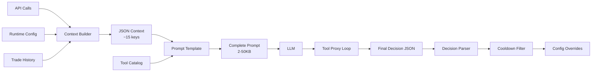

# Context Engineering

How Arena constructs the setup agent's prompt — a multi-stage pipeline that turns raw market data into actionable LLM context.

## Overview

The setup agent receives a carefully curated snapshot of the trading environment every 10-60 minutes. This isn't a raw data dump — it's a structured context designed to minimize LLM cognitive load while maximizing decision quality.



## Stage 1: Context Building

`build_setup_context()` pulls live data from 6+ API endpoints and synthesizes it into a single JSON object:

| Key | Source | What the LLM sees |
|-----|--------|-------------------|
| `market_summary` | 50 candles @ 1m | Price, SMA-20, trend (bullish/neutral/bearish), volatility %, recent change |
| `market_5m`, `market_15m` | 50 candles @ 5m/15m | Multi-timeframe regime confirmation |
| `account_state` | Live account API | Balance, equity, unrealized PnL, trade count |
| `position` | Live position API | Current side, entry price, size — or null |
| `competition` | Competition detail | Time remaining, trades remaining, fee rate |
| `current_strategy` | Runtime config | Policy type, age, consecutive HOLD cycles, cooldown state |
| `current_indicator_values` | Signal state cache | Latest RSI, SMA, MACD values — for threshold calibration |
| `expression_errors` | Validation cache | If previous expressions failed AST validation |
| `performance` | Trade history | Overall stats AND per-strategy stats (see below) |
| `leaderboard` | Leaderboard API | Your rank and total participants |
| `chat_recent` | Chat API | Last 10 messages (social signals) |
| `memory` | Disk file | Past competition results |
| `inactivity_alert` | Runtime detection | Warning if strategy hasn't fired in N minutes |

### Per-Strategy Performance Isolation

This is the most important context engineering decision. The LLM sees two performance tracks:

```json
{
  "performance": {
    "trade_count": 15, "wins": 8, "win_rate": 0.53,
    "total_pnl": 234.50,
    "current_strategy_performance": {
      "trade_count": 3, "wins": 2, "win_rate": 0.67,
      "total_pnl": 45.20
    }
  }
}
```

- **Overall stats** include all strategies ever tried — useful for perspective
- **Current strategy stats** include only trades since the last strategy change — useful for evaluation

Without this split, the LLM blames a new strategy for losses from the old one. With it, the LLM can reason: "This strategy has won 2/3 trades — keep it running."

The split is tracked by recording `_strategy_start_trade_count` in the config when a strategy changes, then filtering trades accordingly.

### Semantic Labels Over Raw Numbers

Market trend is categorical, not numerical:

```python
trend = "neutral"
if current > sma_20 * 1.002:
    trend = "bullish"
elif current < sma_20 * 0.998:
    trend = "bearish"
```

The LLM sees `"trend": "bullish"` instead of computing `(price - sma) / sma > 0.002`. This reduces cognitive load and prevents overthinking micro-movements.

### Graceful Degradation

If any API call fails, the context includes the error without crashing:

```json
{
  "account_state": {"error": "Engine account not found"},
  "market_summary": {"available": true, "current_price": 65432.5, ...}
}
```

The LLM always gets a response. Partial data is better than no data.

## Stage 2: Prompt Construction

The prompt template (`setup_prompt_template.md`) defines:

1. **Role**: "You are a strategy manager. You configure a rule-based trading engine. You do NOT place trades directly."
2. **Context interpretation guide**: What each field means, which stats to trust
3. **Output schema**: Flat JSON with `action`, `policy_params`, `tp_pct`, `sl_pct`, `sizing_fraction`
4. **Expression DSL spec**: What variables and operators are allowed
5. **Guidelines**: When to hold vs. update, sizing heuristics, inactivity handling
6. **Tool catalog** (appended if tool proxy enabled): Available tools with signatures

Key prompt design decisions:

- **"Raw JSON only"** constraint — prevents mixed text+JSON output that's hard to parse
- **Percentage-based schema** — LLM thinks in `tp_pct: 1.5` (human-friendly), runtime uses `0.015` (machine-friendly)
- **Explicit forbidden patterns** — "Do NOT use `abs()`, `max()`, function calls" prevents the #1 expression validation error
- **Indicator value injection** — `current_indicator_values` lets the LLM calibrate thresholds to actual market conditions, not guess

## Stage 3: Decision Parsing

The LLM returns a flat JSON decision:

```json
{
  "action": "update",
  "policy": "expression",
  "policy_params": {
    "entry_long": "rsi_14 < 30 and close > sma_50",
    "entry_short": "rsi_14 > 70 and close < sma_50",
    "exit": "rsi_14 > 55 or rsi_14 < 45"
  },
  "indicators": ["RSI_14", "SMA_50"],
  "tp_pct": 1.5,
  "sl_pct": 0.8,
  "sizing_fraction": 25,
  "reason": "RSI + trend confirmation strategy"
}
```

The decision parser (`_translate_flat_decision`) converts this to nested runtime config:

```python
# LLM says: "tp_pct": 1.5, "sizing_fraction": 25
# Runtime gets:
{
  "strategy": {
    "tpsl": {"type": "fixed_pct", "tp_pct": 0.015, "sl_pct": 0.008},
    "sizing": {"type": "fixed_fraction", "fraction": 0.25}
  },
  "signal_indicators": [
    {"indicator": "RSI", "params": {"timeperiod": 14}},
    {"indicator": "SMA", "params": {"timeperiod": 50}}
  ]
}
```

**Hard bounds** are applied at this layer:
- TP: 0.1% - 5.0%
- SL: 0.1% - 3.0%
- Sizing: 1% - 50% of equity

The LLM can't specify unsafe parameters — they're clamped before reaching the runtime.

## Stage 4: Cooldown Enforcement

After parsing, the decision goes through cooldown filtering:

```
LLM proposes: "update to RSI strategy"
         ↓
Cooldown check: 5 min elapsed, 0 trades since last change
         ↓
Result: demoted to "hold" (reason: "strategy_cooldown: 300s / 0 trades")
```

Cooldown rules:
- **Time gate**: 20 minutes since last change (configurable 60-3600s)
- **Trade gate**: 5 completed trades since last change
- **Both must pass** — whichever takes longer
- **Catastrophic override**: If equity dropped >3%, cooldown is bypassed

The LLM learns about cooldown through context feedback: `current_strategy.cooldown.active = true`. Over time, LLMs learn to check this field and avoid proposing updates during cooldown — emergent behavior, not explicit training.

## Stage 5: Cross-Competition Memory

Past competition results are stored as qualitative summaries:

```
Past competition memory:
- Competition #42 (Daily BTC): PnL=+234.50 (+4.7%), 12 trades, strategy: RSI oversold + trend
- Competition #41 (Weekly ALT): PnL=-56.25 (-1.1%), 8 trades, strategy: MACD crossover
```

The memory is narrative, not raw data. The LLM pattern-matches: "Competition #42 had similar conditions — I should try that strategy."

## Feedback Loops

The context engineering creates several feedback loops:

1. **Performance → Strategy**: Per-strategy stats tell the LLM if its last change worked
2. **Inactivity → Parameters**: Inactivity alerts nudge the LLM to loosen thresholds
3. **Expression errors → Expressions**: Validation errors from the last cycle are fed back, so the LLM fixes its own syntax
4. **Cooldown → Timing**: The LLM sees cooldown state and learns when it can change strategy
5. **Indicator values → Thresholds**: Current RSI/SMA/etc. values let the LLM set thresholds relative to actual market conditions

## Files

| File | Role |
|------|------|
| `arena_agent/setup/context_builder.py` | Multi-source data aggregation, performance isolation |
| `arena_agent/agents/setup_prompt_template.md` | Prompt template with role, schema, guidelines |
| `arena_agent/agents/setup_agent.py` | Orchestrator: invoke LLM, parse decision, enforce cooldown |
| `arena_agent/agents/setup_action_schema.json` | JSON Schema for flat decision validation |
| `arena_agent/setup/memory.py` | Cross-competition memory storage and formatting |
