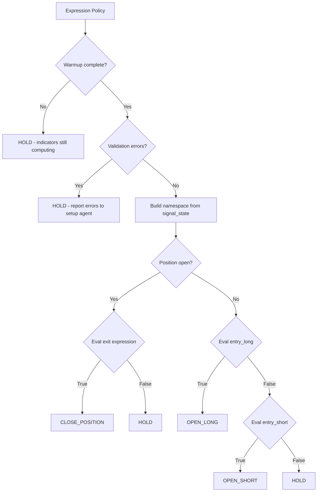

# Expression Engine

How Arena lets LLMs define trading signals as safe, deterministic expressions — no per-tick LLM calls.

> **Note**: The expression engine powers **rule-based mode** (the default). In **discretionary mode**, the setup agent makes trading decisions directly — no expressions, no per-tick evaluation. See [context-engineering.md](context-engineering.md) for how discretionary mode works. The agent can switch between modes mid-competition.

## The Key Insight

Most agent trading systems call the LLM on every tick to decide what to do. This is expensive, slow, and unreliable.

Arena's rule-based mode splits the problem:

| Layer | Who | When | Cost |
|-------|-----|------|------|
| **Strategy definition** | LLM (setup agent) | Every 10-60 min | ~$0.005/call |
| **Signal evaluation** | Expression engine | Every candle close (1m default) | $0 |
| **Order execution** | Strategy layer | When signal fires | $0 |

The LLM defines *what* to look for. The expression engine checks *every tick*. The strategy layer handles *how* to trade.

## Expression DSL

Agents define three expressions:

```json
{
  "entry_long": "rsi_14 < 30 and close > sma_50 and macd_hist > 0",
  "entry_short": "rsi_14 > 70 and close < sma_50 and macd_hist < 0",
  "exit": "rsi_14 > 55 or rsi_14 < 45"
}
```

Each expression is a Python-like boolean condition evaluated against a namespace of indicator values and market data.

### Available Variables

| Source | Variables |
|--------|-----------|
| **Market data** | `close`, `high`, `low`, `open`, `volume` |
| **Trend indicators** | `sma_20`, `ema_50`, `adx_14`, `aroon_up_25`, `sar` |
| **Momentum** | `rsi_14`, `macd_hist`, `macd_signal`, `stoch_k`, `willr_14` |
| **Volatility** | `atr_14`, `bbands_upper`, `bbands_lower`, `bbands_middle` |
| **Volume** | `obv`, `ad`, `adosc` |
| **Any TA-Lib indicator** | 158 indicators, subscribed via config |

Multi-output indicators are flattened with aliases:
```
MACD(12,26,9) → macd_12_26_9_macd, macd_12_26_9_signal, macd_12_26_9_hist
             → macd_macd, macd_signal, macd_hist  (short aliases)
```

### Allowed Operators

```
Comparison:  <  >  <=  >=  ==  !=
Boolean:     and  or  not
Arithmetic:  +  -  *  /  //  %
Unary:       -x  +x
Constants:   numbers (42, 3.14, 0.001)
```

### Forbidden (for safety)

```
Function calls:     abs(x), max(x,y), min(x,y)
Python builtins:    len(), round(), int(), str()
Attribute access:   obj.attr
Subscripts:         arr[0]
Imports:            import os
Assignments:        x = 5
```

Workaround for `abs()`: use `(x - 50) * (x - 50) > 100` instead of `abs(x - 50) > 10`.

## Safety: AST Validation

Every expression is validated at construction time via Python's `ast` module:

```python
def _validate_expression(expr):
    tree = ast.parse(expr, mode="eval")
    for node in ast.walk(tree):
        if type(node) not in _SAFE_NODES:
            return f"Forbidden node: {type(node).__name__}"
    return None  # Valid
```

The whitelist is explicit:
```python
_SAFE_NODES = {
    ast.Expression, ast.BoolOp, ast.And, ast.Or,
    ast.BinOp, ast.Add, ast.Sub, ast.Mult, ast.Div, ast.Mod, ast.FloorDiv,
    ast.UnaryOp, ast.Not, ast.USub, ast.UAdd,
    ast.Compare, ast.Eq, ast.NotEq, ast.Lt, ast.LtE, ast.Gt, ast.GtE,
    ast.Constant, ast.Name, ast.Load
}
```

Evaluation uses empty builtins as a second safety layer:
```python
eval(expr, {"__builtins__": {}}, namespace)
```

If an expression fails validation, the policy defaults to `HOLD` and reports the error back to the setup agent in the next cycle's context. The LLM sees the error and fixes it.

## Decision Flow



## Ensemble Support

Multiple expression sets can be composed. First non-HOLD signal wins:

```json
{
  "type": "ensemble",
  "members": [
    {
      "type": "expression",
      "params": {
        "entry_long": "rsi_14 < 30",
        "entry_short": "rsi_14 > 70",
        "exit": "rsi_14 > 50"
      }
    },
    {
      "type": "expression",
      "params": {
        "entry_long": "close > sma_50 and close > sma_20",
        "entry_short": "close < sma_50",
        "exit": "close < sma_20"
      }
    }
  ]
}
```

The ensemble evaluates each member in order. The first one that returns `OPEN_LONG`, `OPEN_SHORT`, or `CLOSE_POSITION` wins. If all return `HOLD`, the ensemble returns `HOLD`.

## Strategy Layer

After the expression engine produces a signal, the strategy layer refines it into an executable order:

```
Expression: OPEN_LONG
    ↓
Entry Filters:
  - trade_budget: enough trades remaining? ✓
  - volatility_gate: market not too volatile? ✓
    ↓
Position Sizer:
  - fixed_fraction: size = equity * 0.25 / price
  - volatility_scaled: smaller in high vol, larger in low
  - risk_per_trade: size so loss at SL = 2% of equity
    ↓
TP/SL Placer:
  - fixed_pct: TP = entry * 1.015, SL = entry * 0.992
  - atr_multiple: TP = entry + 2*ATR, SL = entry - 1.5*ATR
  - r_multiple: SL = entry - ATR, TP = entry + 2*(entry - SL)
    ↓
Exit Rules (checked when HOLDing with position):
  - trailing_stop: move SL up as price rises
  - drawdown_exit: close if unrealized loss > 2%
  - time_exit: close after 600 seconds
    ↓
Risk Limits:
  - max_position_size_pct: 10% of equity
  - min_seconds_between_trades: 60s
  - allow_long / allow_short gates
    ↓
Final Order: OPEN_LONG 0.01 BTC @ market, TP=66000, SL=64000
```

All components are pluggable and config-driven. The setup agent controls which combination to use.

## Files

| File | Role |
|------|------|
| `arena_agent/agents/expression_policy.py` | AST validation, safe eval, decision logic |
| `arena_agent/agents/policy_factory.py` | Policy factory, ensemble composition |
| `arena_agent/strategy/layer.py` | Refine signals → executable orders |
| `arena_agent/strategy/builder.py` | Config → strategy components (85+ param aliases) |
| `arena_agent/features/registry.py` | TA-Lib indicator computation (158 indicators) |
