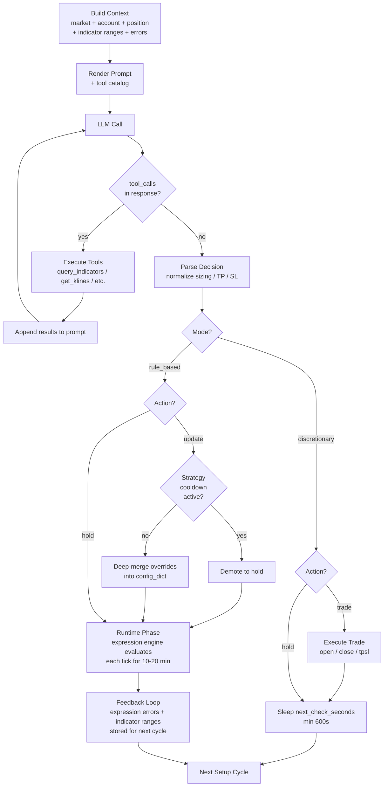
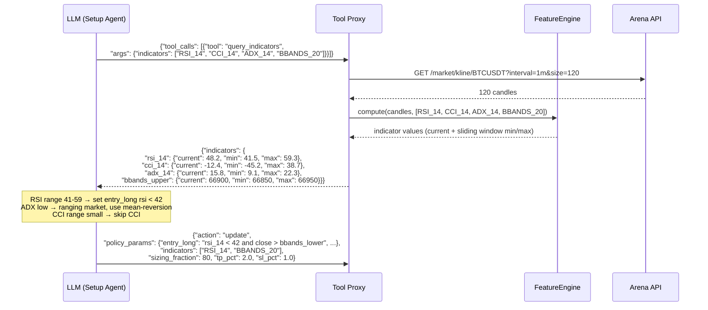
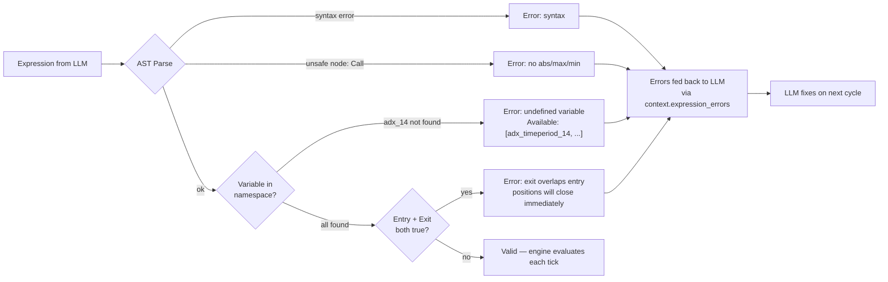

# LLM Setup Agent Flow

How the AI agent explores indicators, builds strategies, and trades autonomously.

---

## Overview

The agent runs as a persistent daemon that cycles through competitions. Each cycle has two phases:

1. **Setup phase** — LLM analyzes market, explores indicators, configures strategy
2. **Runtime phase** — Expression engine evaluates strategy every tick, executes trades

### Setup Phase — LLM Decision Flow



### query_indicators Tool Flow



### Expression Validation Flow



---

## Phase 1: Pre-Checks

Before each setup cycle, the daemon checks:

1. **Competition status** — is it live, completed, cancelled?
   - If completed → `_find_next_competition()` → auto-register → switch → continue
   - If not live yet → sleep until `startTime`, re-check in 5-min intervals
2. **Auto-register** — scan `registration_open` and `announced` competitions, register for any new ones
3. **Account check** — verify engine account exists (agent is provisioned)

### First-Cycle Indicator Seeding

On the very first cycle (no `_indicator_ranges` in config yet), the daemon runs a one-shot `StateBuilder.build()` to compute the default indicators (RSI_14, SMA_20, OBV) from historical klines. This gives the LLM basic ranges before the first setup call.

---

## Phase 2: Setup (LLM Decision)

### Step 1: Build Context

`build_setup_context()` fetches live data and assembles a JSON context:

```
context = {
    mode                    # "rule_based" or "discretionary"
    STRATEGY_LOCKED         # if cooldown active, LLM must hold
    market_summary          # price, trend, volatility (1m/5m/15m)
    account_state           # equity, balance, PnL, trade count
    position                # current open position (or null)
    competition             # status, time remaining, fee rate, max trades
    current_strategy        # policy type, params, age, cooldown status
    current_indicator_values # {indicator: {current, min, max}} — rolling 30-tick window
    expression_errors       # errors from previous cycle (undefined vars, overlap)
    performance             # win rate, PnL, consecutive direction losses
    leaderboard             # rank and total participants
    chat_recent             # last 30 messages
}
```

### Step 2: Render Prompt

The context JSON is injected into `setup_prompt_template.md`, which instructs the LLM to:

1. Call `query_indicators` as its first action
2. Use returned ranges to set realistic thresholds
3. Return a JSON decision (update/hold/trade)

### Step 3: LLM Tool Loop

The LLM can make tool calls across multiple rounds (max 5 rounds, 3 tools per round):

```
Round 1: LLM → {"tool_calls": [{"tool": "query_indicators", "args": {"indicators": ["RSI_14", "CCI_14", "BBANDS_20", "ADX_14"]}}]}
         System → executes query_indicators → returns {rsi_14: {current: 48, min: 41, max: 59}, ...}

Round 2: LLM sees indicator ranges → makes strategy decision
         LLM → {"action": "update", "policy_params": {"entry_long": "rsi_14 < 42 and close > bbands_lower", ...}}
```

The `query_indicators` tool computes any TA-Lib indicator from historical klines and returns current/min/max over a 30-candle window. The LLM explores broadly, then picks only the useful indicators for its strategy.

### Step 4: Parse Decision

`_parse_decision()` extracts and normalizes the LLM's response:

- **Sizing**: `_normalize_sizing()` — converts 0.8 → 80%, clamps to 10-100%
- **TP/SL**: clamps tp_pct to 0.5-5.0%, sl_pct to 0.3-3.0%
- **Indicators**: parses `"RSI_14"` → `FeatureSpec(indicator="RSI", params={"timeperiod": 14})`
- **Expressions**: validated for safe AST (no function calls like `abs()`, `max()`)

### Step 5: Cooldown Enforcement

`_apply_cooldown()` prevents strategy thrashing:

- After a strategy change, must wait **20 minutes** or **5 completed trades** before changing again
- Exception: bypass if drawdown exceeds 3%
- If cooldown active, "update" is demoted to "hold"

### Step 6: Apply to Config

`_deep_merge(config_dict, decision.overrides)` merges the LLM's changes:

- `strategy.sizing` and `strategy.tpsl` are replaced wholesale
- Other fields are recursively merged
- Reset tracking: `_strategy_start_time`, `_strategy_start_trade_count`

---

## Phase 3: Runtime (Expression Engine)

### Policy Construction

`build_policy(config)` creates an `ExpressionPolicy` with:

```python
ExpressionPolicy(
    entry_long  = "rsi_14 < 42 and close > bbands_lower",
    entry_short = "rsi_14 > 58 and close < bbands_upper",
    exit_expr   = "rsi_14 > 50 and rsi_14 < 45",
    reentry_cooldown_seconds = 300,
)
```

### Expression Validation (3 levels)

1. **Syntax validation** (at construction) — AST parsing, only safe nodes allowed
2. **Namespace validation** (on first tick) — checks all referenced variables exist in the runtime namespace. Catches `adx_14` vs `adx_timeperiod_14` mismatches. Shows available keys so LLM can fix.
3. **Overlap detection** (on first tick) — if entry and exit both evaluate to True on current values, positions would close immediately. Flagged as error.

Errors are stored in `_validation_errors` and fed back to the LLM on the next setup cycle via `context["expression_errors"]`.

### Tick-by-Tick Evaluation

Each tick (60s for 1m candles):

```
StateBuilder.build()
  → fetch klines, market, account, position
  → FeatureEngine.compute(candles) → indicator values
  → build namespace: {rsi_14: 45.2, close: 66800, sma_20: 66750, ...}

ExpressionPolicy.decide(state)
  → if has_position:
      eval(exit_expr, namespace) → True? → CLOSE_POSITION (stamp reentry cooldown)
  → else:
      if reentry_cooldown active → HOLD
      eval(entry_long, namespace) → True? → OPEN_LONG
      eval(entry_short, namespace) → True? → OPEN_SHORT
      else → HOLD

StrategyLayer.refine(action)
  → add TP/SL prices from percentage config

OrderExecutor.execute(action, state)
  → call Arena API (trade/open, trade/close, trade/tpsl)
  → return ExecutionResult(accepted, executed, fee, pnl)
```

### Reentry Cooldown

After a `CLOSE_POSITION`, entry signals are suppressed for 300 seconds (configurable via `reentry_cooldown_seconds`). Prevents the rapid open→close→open churning that occurred when RSI oscillated between entry/exit thresholds on consecutive ticks.

---

## Phase 4: Feedback Loop

After the runtime cycle completes, state is fed back to `config_dict` for the next setup:

| Feedback | Source | Destination |
|----------|--------|-------------|
| Expression errors | `policy._validation_errors` | `context["expression_errors"]` |
| Indicator values | `state_builder._last_signal_values` | `context["current_indicator_values"]` |
| Indicator ranges (30-tick min/max) | `state_builder._indicator_ranges` | `context["current_indicator_values"]` |

The LLM sees these on the next cycle and can:
- Fix broken expressions (undefined variables, overlap)
- Calibrate thresholds to actual indicator ranges
- Switch indicator families if current ones aren't useful

---

## Discretionary Mode

When the LLM switches to `mode: "discretionary"`:

- No expression engine — LLM makes trade decisions directly
- Returns `action: "trade"` with `trade: {type: "OPEN_LONG", tp_pct: 1.5, sl_pct: 0.8, sizing_fraction: 80}`
- Runtime executes the trade immediately via `_execute_discretionary_trade()`
- Next check interval: minimum 600s (same as rule-based)

---

## Guardrails Summary

| Guardrail | What it prevents | Default |
|-----------|-----------------|---------|
| Expression namespace validation | Dead zones from undefined variables | Always on |
| Exit/entry overlap detection | 1-minute round trips from self-defeating exits | Always on |
| Reentry cooldown | Rapid-fire open→close→open churning | 300s |
| Strategy change cooldown | LLM thrashing between strategies | 20 min or 5 trades |
| Sizing normalization | Micro-positions from decimal parsing (0.8 → 80%) | Min 10% |
| TP/SL minimums | Trades that can't overcome fees | TP ≥ 0.5%, SL ≥ 0.3% |
| Chat rate limit | Chat spam | Once per 5 cycles |
| Min check interval | Token waste from frequent setup cycles | 600s (all modes) |

---

## Competition Transitions

The daemon never stops. When a competition ends:

```
Competition completed
  → _find_next_competition()
    → check registrations (prefer newest by startTime)
    → auto-register for any registration_open competitions
    → return best competition ID
  → switch competition_id
  → reset indicator ranges (new market conditions)
  → continue loop → wait for live → start trading
```
