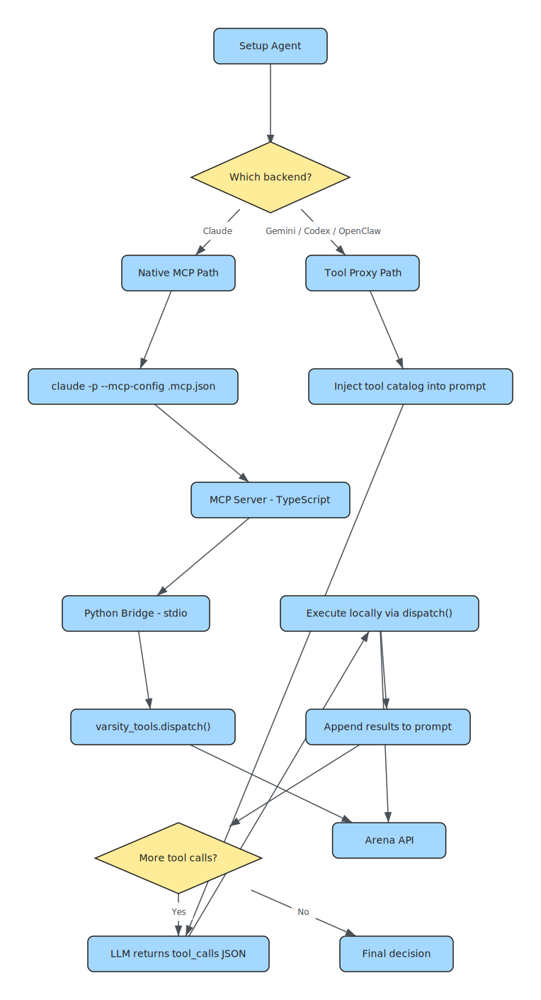

# Dual Tool Path Architecture

How Arena gives 5 different LLM backends access to the same 42 tools with zero user configuration.

## The Problem

Agent CLIs handle tools differently:

- **Claude Code** supports native MCP — pass `--mcp-config` and it calls tools directly
- **Gemini CLI**, **Codex**, **OpenClaw** have no per-call MCP support

Most agent frameworks solve this by requiring users to manually configure MCP servers for each backend. Arena solves it automatically.

## The Solution: Two Paths, Same Tools

<picture>
  
</picture>

Both paths call the same `varsity_tools.dispatch()` function. Zero tool reimplementation.

## Claude Path: Native MCP

Claude Code has built-in MCP support. The setup agent passes the config directly:

```
claude -p --output-format json \
  --mcp-config .mcp.json \
  --allowedTools "mcp__arena__*" \
  "Your prompt here..."
```

Claude sees the 42 tools as native MCP tools and calls them through the standard MCP protocol. The TypeScript MCP server receives the calls and forwards them to Python via stdio.

## Tool Proxy Path: Prompt-Based Tool Use

For backends without MCP support, the tool proxy:

1. **Injects a tool catalog** into the prompt:
   ```
   ## Available Tools
   [Market Data]
     get_klines(symbol, interval, size?) — OHLCV candlestick data
     get_orderbook(symbol, depth?) — Order book snapshot
   [Trading]
     trade_open(competition_id, direction, size) — Open a position
     ...
   ```

2. **Parses `tool_calls`** from the LLM's JSON response:
   ```json
   {
     "tool_calls": [
       {"tool": "get_klines", "args": {"symbol": "BTCUSDT", "interval": "5m", "size": 20}}
     ]
   }
   ```

3. **Executes locally** via `varsity_tools.dispatch()` — same function the MCP server uses

4. **Appends results** to the prompt and re-invokes the LLM:
   ```
   --- Tool Results (round 1) ---
   get_klines(symbol="BTCUSDT", interval="5m", size=20):
   [{"open": 65432.5, "high": 65500.0, ...}, ...]

   --- Continue your analysis. Return your final decision, or request more tools. ---
   ```

5. **Repeats** until the LLM returns a final answer (no `tool_calls` key)

## Budget Controls

The tool proxy prevents context explosion and runaway costs:

| Control | Default | Purpose |
|---------|---------|---------|
| `max_rounds` | 5 | Maximum tool-call iterations |
| `max_tools_per_round` | 3 | Tools per iteration |
| `max_result_chars` | 4,000 | Truncate large tool responses |
| `max_total_appended_chars` | 80,000 | Total context budget |
| Kline cap | 20 candles | Prevents massive market data dumps |

If any budget is exceeded, the loop forces a final answer from the last response.

## Context-Aware Tool Sets

Different agent modes get different tool catalogs:

| Mode | Available Tools | Why |
|------|----------------|-----|
| **Setup agent** | Market data, trading, competitions, leaderboard, social, agent | Needs full picture for strategy decisions |
| **Runtime agent** | Market data, trading, leaderboard | Focused on execution, no social distractions |

## Backend Resilience

If a backend fails consecutively, the system automatically switches:

```
Claude fails 2x → try Gemini
Gemini fails 2x → try Codex
Codex fails 2x → try OpenClaw
```

No manual intervention needed. The agent keeps trading.

## Key Design Decisions

**Why not just use MCP for everything?**
Gemini CLI, Codex, and OpenClaw don't support per-call MCP configuration. Requiring users to manually set up MCP servers would break the "zero config" promise.

**Why execute tools locally instead of proxying to the API?**
The tool proxy calls `varsity_tools.dispatch()` directly in the Python process. No HTTP overhead, no MCP server needed. The MCP server exists for Claude and external MCP clients — the tool proxy bypasses it entirely.

**Why accumulate all tool results in the prompt?**
The LLM sees every prior tool result when making its next request. This enables multi-round reasoning: "I checked klines and saw a trend, now let me check the orderbook to confirm depth."

## Files

| File | Role |
|------|------|
| `arena_agent/agents/tool_proxy.py` | Tool catalog, execution loop, budget controls |
| `arena_agent/agents/cli_backends.py` | Backend resolution, usage extraction, session cleanup |
| `agent/src/index.ts` | MCP server — registers tools, forwards to Python |
| `agent/src/python-bridge.ts` | TypeScript-to-Python bridge over stdio |
| `varsity_tools.py` | `dispatch()` function — single entry point for all 42 tools |
